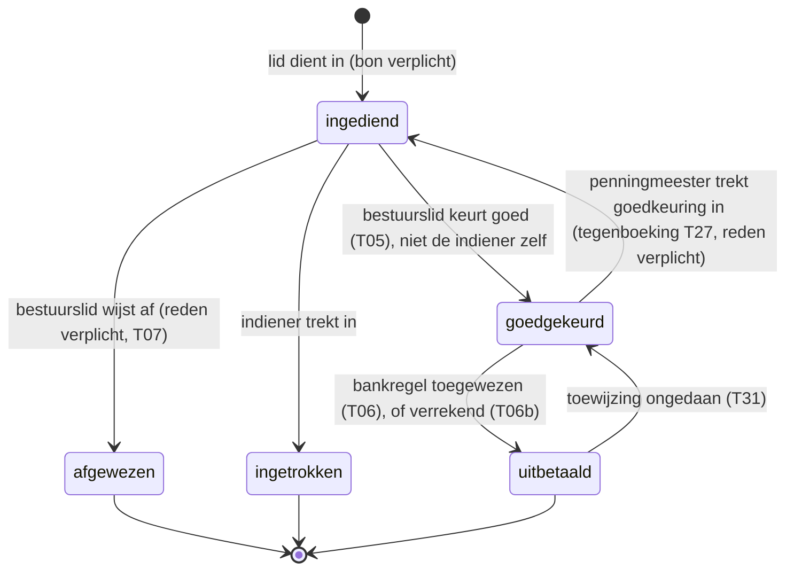
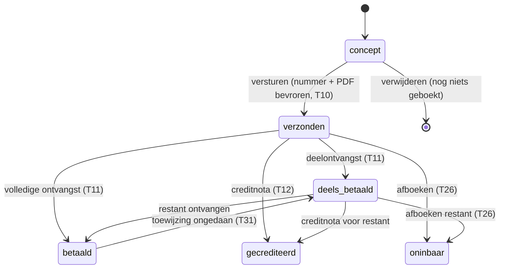
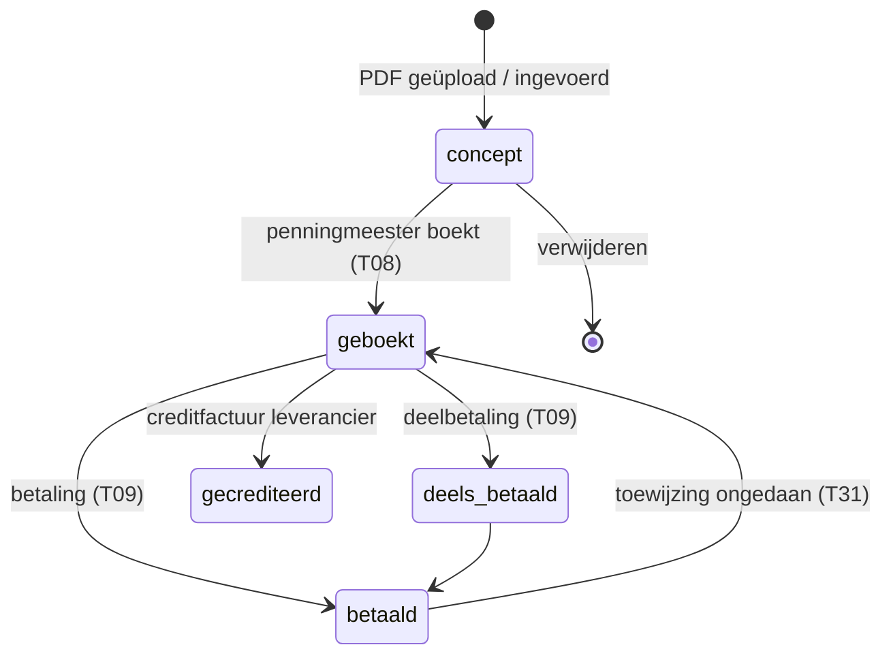
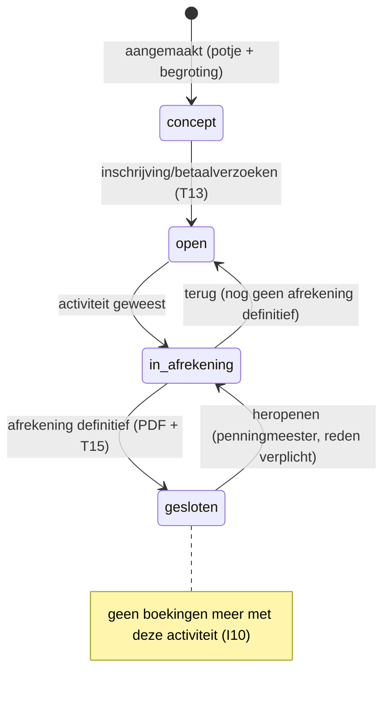
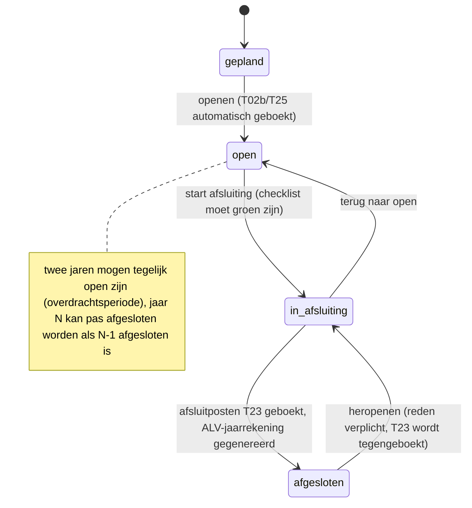

# PLAN — Boekhouding voor een studentendispuut

> Status: **concept, wacht op goedkeuring**. Er wordt geen code geschreven voordat dit plan is goedgekeurd.
> Open vragen staan in §13. Waar een keuze nog niet vastligt, staat de voorgestelde standaard erbij, gemarkeerd met **[VRAAG n]**.

---

## 0. Samenvatting van het ontwerp

- **Eén dispuut per installatie** (single-tenant). Multi-tenant staat niet in scope; het datamodel blokkeert het niet (alles hangt aan `fiscal_year`).
- **Het grootboek is de enige plek waar geld "bestaat"**. Alle andere tabellen (declaraties, facturen, contributie, activiteiten) zijn *documenten* die journaalposten veroorzaken. Saldi (banksaldo, ledensaldo, openstaande posten, resultaat per potje) worden **altijd afgeleid** uit de journaalregels, nooit apart bijgehouden.
- **Elke banktransactie wordt bij import direct geboekt** op de rekening *Te verwerken bankmutaties* (1099). Daardoor klopt het banksaldo in het grootboek **altijd** met de bank, ook als er nog niets is toegewezen. Toewijzen is een tweede journaalpost die het bedrag van 1099 naar de juiste plek verplaatst. *"X transacties nog toe te wijzen"* = aantal banktransacties waarvan het saldo op 1099 ≠ 0. Nul = de boekhouding is bij.
- **Potjes zijn een dimensie**, geen losse grootboekrekening: elke regel op een resultaatrekening draagt verplicht een `pot_id`. Zo kan "Activiteitsbijdragen" zowel bij potje *Activiteiten* als bij potje *Lustrum* horen, en is begroting-vs-realisatie per potje één query. **[VRAAG 11]**
- **Saldi zijn cumulatief over boekjaren heen**: er zijn geen "beginbalans"-boekingen per jaar (behalve één keer bij de allereerste start). Balansrekeningen lopen door; resultaatrekeningen worden bij jaarafsluiting naar nul geboekt. Heropenen van een oud jaar werkt daardoor automatisch door in latere jaren, zonder handmatige doorboekingen.
- **Onveranderlijkheid wordt in de database afgedwongen** (triggers + ontbrekende UPDATE/DELETE-rechten voor de app-rol), niet alleen in de applicatiecode.

---

## 1. Architectuur

```
Browser (Next.js App Router, RSC + server actions, shadcn/ui, NL-UI)
   │
   ▼
src/app/**            ← routes, pagina's, server actions (dunne laag: auth → Zod → service)
src/server/services   ← use-cases (importBank, approveClaim, closeActivity, closeFiscalYear …)
src/domain/**         ← PURE functies: journaalpost-templates, matching, contributie-berekening,
                         money, kenmerken, SEPA-XML-opbouw, rapport-berekeningen. Geen DB, geen I/O.
src/server/ledger     ← postEntry(): de énige functie die journaal_entry/journal_line schrijft
src/server/bank       ← BankConnector-interface + implementaties (rabobank-csv, camt053, later psd2)
src/server/db         ← Drizzle schema, migraties, SQL-triggers
src/server/pdf        ← @react-pdf/renderer documenten
src/server/export     ← exceljs, zip (kascommissie-pakket)
src/server/storage    ← S3-client (MinIO lokaal)
```

Regel: **alle geldmutaties lopen via `postEntry()`** binnen één DB-transactie samen met de statuswijziging van het document en de audit-logregel. Lukt één van de drie niet, dan gebeurt er niets.

---

## 2. Datamodel

### 2.1 Conventies

| Onderwerp | Keuze |
|---|---|
| Bedragen | `bigint` in eurocenten; in TS een branded `Cents` (`number`, `Number.isSafeInteger` gecontroleerd). Nooit `parseFloat`: bedragstrings worden als string geparsed. Verdelingen (pro rata) met *largest remainder* zodat de som exact klopt. |
| Teken | Journaalregel `amount_cents`: **positief = debet, negatief = credit**. Som per journaalpost = 0. |
| Sleutels | `uuid` (v7, tijd-sorteerbaar) voor entiteiten; `bigserial` voor audit log. |
| Tijd | `timestamptz` voor momenten, `date` voor boekdatum/valutadatum (Europe/Amsterdam). |
| Soft delete | Bestaat niet voor financiële data. Stamdata (leden, relaties, rekeningen, potjes) krijgt `active boolean`. |
| Btw-voorbereiding | `journal_line.vat_code` en `account.default_vat_code` (nullable, nu altijd `NULL`). |

### 2.2 ERD

```mermaid
erDiagram
    FISCAL_YEAR ||--o{ JOURNAL_ENTRY : bevat
    FISCAL_YEAR ||--o{ BUDGET_LINE : heeft
    FISCAL_YEAR ||--o{ ROLE_ASSIGNMENT : "rollen per jaar"
    JOURNAL_ENTRY ||--|{ JOURNAL_LINE : "regels (som = 0)"
    JOURNAL_ENTRY |o--o| JOURNAL_ENTRY : "tegenboeking van"
    ACCOUNT ||--o{ JOURNAL_LINE : op
    POT ||--o{ JOURNAL_LINE : "dimensie"
    POT ||--o{ BUDGET_LINE : begroot
    POT ||--o{ ACTIVITY : "hoort bij"
    ACTIVITY ||--o{ JOURNAL_LINE : "dimensie"
    PARTY ||--o{ JOURNAL_LINE : "subadministratie"
    OPEN_ITEM ||--o{ JOURNAL_LINE : "afgeletterd door"
    PARTY ||--o| MEMBER : "is"
    PARTY ||--o| RELATION : "is"
    MEMBER ||--o{ MANDATE : heeft
    MEMBER |o--o| APP_USER : "logt in als"
    APP_USER ||--o{ ROLE_ASSIGNMENT : krijgt
    PARTY ||--o{ OPEN_ITEM : "debiteur/crediteur"

    BANK_ACCOUNT ||--o{ BANK_TRANSACTION : bevat
    BANK_ACCOUNT }o--|| ACCOUNT : "grootboekrekening"
    BANK_IMPORT ||--o{ BANK_TRANSACTION : importeerde
    BANK_TRANSACTION ||--o{ JOURNAL_LINE : "import- en toewijsposten"
    MATCH_RULE ||--o{ MATCH_SUGGESTION : genereert
    BANK_TRANSACTION ||--o{ MATCH_SUGGESTION : krijgt
    CASH_COUNT }o--|| BANK_ACCOUNT : "kas"

    CONTRIBUTION_PERIOD ||--o{ CONTRIBUTION_RATE : tarieven
    CONTRIBUTION_PERIOD ||--o{ CONTRIBUTION_CHARGE : aanslagen
    CONTRIBUTION_CHARGE ||--|| OPEN_ITEM : "openstaande post"
    SEPA_BATCH ||--|{ SEPA_BATCH_ITEM : bevat
    SEPA_BATCH_ITEM }o--|| OPEN_ITEM : int
    SEPA_BATCH_ITEM }o--|| MANDATE : "onder mandaat"

    EXPENSE_CLAIM ||--o| OPEN_ITEM : "schuld na goedkeuring"
    PURCHASE_INVOICE ||--|| OPEN_ITEM : crediteur
    SALES_INVOICE ||--|{ SALES_INVOICE_LINE : regels
    SALES_INVOICE ||--|| OPEN_ITEM : debiteur
    ACTIVITY ||--o{ ACTIVITY_PARTICIPANT : deelnemers
    ACTIVITY_PARTICIPANT ||--o| OPEN_ITEM : betaalverzoek
    SETTLEMENT }o--o| JOURNAL_ENTRY : "boeking (indien mutatie)"
    SETTLEMENT ||--|| ATTACHMENT : "PDF"
    ATTACHMENT }o--o{ EXPENSE_CLAIM : bon
    AUDIT_LOG }o--|| APP_USER : door

    FISCAL_YEAR {
        uuid id PK
        text label "2025-2026"
        date start_date
        date end_date
        enum status "planned|open|closing|closed"
        int next_entry_number "gapless teller"
    }
    ACCOUNT {
        uuid id PK
        text code UK "bv. 1300"
        text name
        enum type "asset|liability|equity|income|expense"
        text system_key UK "bv. BANK_SUSPENSE, null voor eigen rekeningen"
        bool requires_party
        bool requires_pot
        bool manual_posting_allowed "false voor bank/kas/1099/0590"
        text default_vat_code "altijd null (btw later)"
        bool active
    }
    POT {
        uuid id PK
        text code UK
        text name "Borrels, Lustrum, ..."
        uuid default_income_account_id FK
        uuid default_expense_account_id FK
        bool active
    }
    BUDGET_LINE {
        uuid id PK
        uuid fiscal_year_id FK
        uuid pot_id FK
        uuid account_id FK "optioneel, anders pot-niveau"
        enum kind "income|expense"
        bigint amount_cents
        text note
    }
    JOURNAL_ENTRY {
        uuid id PK
        uuid fiscal_year_id FK
        text entry_number UK "2025-000123"
        date entry_date
        text template "zie paragraaf 4"
        text description
        text source_type "bank_transaction|expense_claim|..."
        uuid source_id
        uuid reverses_entry_id FK "tegenboeking"
        bool is_automatic "door matching engine"
        text reason "verplicht bij memoriaal/tegenboeking"
        uuid created_by FK
        timestamptz created_at
    }
    JOURNAL_LINE {
        uuid id PK
        uuid entry_id FK
        int line_no
        uuid account_id FK
        bigint amount_cents "+debet / -credit"
        uuid pot_id FK "verplicht op resultaatrekeningen"
        uuid activity_id FK
        uuid party_id FK "verplicht op 1300/1310/1600/1610"
        uuid open_item_id FK
        uuid bank_transaction_id FK
        text description
        text vat_code "null"
    }
    PARTY {
        uuid id PK
        enum kind "member|relation"
        text display_name
        text email
        text iban
        text bic
    }
    MEMBER {
        uuid party_id PK
        text first_name
        text last_name
        enum status "aspirant|lid|oud_lid|reunist"
        int cohort "jaargang"
        date joined_on
        date left_on
    }
    RELATION {
        uuid party_id PK
        enum relation_type "supplier|sponsor|landlord|other"
        text kvk_number
        text address
    }
    MANDATE {
        uuid id PK
        uuid member_id FK
        text mandate_ref UK
        date signed_on
        text iban
        enum status "active|revoked|expired"
        bool first_collection_done "FRST vs RCUR"
        date last_collected_on "36 mnd inactief = verlopen"
        text original_iban "voor amendement"
    }
    OPEN_ITEM {
        uuid id PK
        enum direction "receivable|payable"
        uuid party_id FK
        uuid account_id FK "1300|1310|1600|1610"
        text source_type
        uuid source_id
        text payment_reference UK "kenmerk"
        bigint original_cents
        date due_date
        enum status "open|partial|settled|written_off|cancelled (cache)"
    }
    BANK_ACCOUNT {
        uuid id PK
        text iban UK "null voor kas"
        text name
        enum kind "checking|savings|cash"
        uuid ledger_account_id FK
        text connector "rabobank_csv|camt053|manual|psd2"
    }
    BANK_IMPORT {
        uuid id PK
        uuid bank_account_id FK
        text format
        text file_sha256
        uuid file_attachment_id FK
        int count_new
        int count_duplicate
        uuid imported_by FK
    }
    BANK_TRANSACTION {
        uuid id PK
        uuid bank_account_id FK
        text external_id "Volgnr / AcctSvcrRef"
        date booking_date
        date value_date
        bigint amount_cents
        bigint balance_after_cents "null bij CAMT"
        text counterparty_iban
        text counterparty_name
        text description "Omschrijving-1..3 samengevoegd"
        text end_to_end_id
        text mandate_ref
        text payment_reference "Betalingskenmerk"
        text return_reason "Reden retour"
        jsonb raw
        enum state "unassigned|suggested|auto_assigned|assigned|internal (cache)"
    }
    MATCH_RULE {
        uuid id PK
        text name
        int priority
        jsonb conditions "iban, regex, bedragrange, richting, rekening"
        jsonb action "split-template"
        numeric confidence
        enum origin "manual|learned"
        bool active
    }
    MATCH_SUGGESTION {
        uuid id PK
        uuid bank_transaction_id FK
        text matcher "reference|sepa|internal|rule|same_as_last|..."
        uuid rule_id FK
        numeric confidence
        jsonb proposal "concept-journaalpost"
        enum outcome "pending|accepted|rejected|superseded"
    }
    CASH_COUNT {
        uuid id PK
        uuid bank_account_id FK
        date counted_on
        jsonb denominations
        bigint counted_cents
        bigint book_cents
        uuid difference_entry_id FK
    }
    CONTRIBUTION_PERIOD {
        uuid id PK
        uuid fiscal_year_id FK
        text name
        date start_date
        date end_date
    }
    CONTRIBUTION_RATE {
        uuid id PK
        uuid period_id FK
        enum member_status
        bigint amount_cents
    }
    CONTRIBUTION_CHARGE {
        uuid id PK
        uuid period_id FK
        uuid member_id FK
        bigint amount_cents
        uuid open_item_id FK
        uuid entry_id FK
    }
    SEPA_BATCH {
        uuid id PK
        text message_id UK
        date collection_date
        enum status "draft|generated|uploaded|processed"
        uuid file_attachment_id FK
    }
    SEPA_BATCH_ITEM {
        uuid id PK
        uuid batch_id FK
        uuid open_item_id FK
        uuid mandate_id FK
        enum sequence_type "FRST|RCUR"
        text end_to_end_id UK
        bigint amount_cents
        enum status "pending|collected|returned"
    }
    EXPENSE_CLAIM {
        uuid id PK
        uuid member_id FK
        uuid fiscal_year_id FK
        bigint amount_cents
        uuid pot_id FK
        uuid activity_id FK
        text description
        text payout_iban
        enum status "submitted|approved|paid|rejected|withdrawn"
        uuid decided_by FK
        text rejection_reason
        uuid open_item_id FK
    }
    PURCHASE_INVOICE {
        uuid id PK
        uuid relation_id FK
        text supplier_invoice_number
        date invoice_date
        date due_date
        bigint amount_cents
        uuid pot_id FK
        uuid activity_id FK
        enum status "draft|booked|partial|paid|credited"
        uuid open_item_id FK
    }
    SALES_INVOICE {
        uuid id PK
        text invoice_number UK "gapless per jaar"
        uuid relation_id FK
        date invoice_date
        date due_date
        enum status "draft|sent|partial|paid|credited|written_off"
        uuid credits_invoice_id FK "creditnota"
        uuid pdf_attachment_id FK
        uuid open_item_id FK
    }
    SALES_INVOICE_LINE {
        uuid id PK
        uuid invoice_id FK
        text description
        bigint amount_cents
        uuid pot_id FK
        uuid account_id FK
    }
    ACTIVITY {
        uuid id PK
        uuid fiscal_year_id FK
        uuid pot_id FK
        text name
        date held_on
        bigint budget_cents
        enum status "draft|open|settling|closed"
    }
    ACTIVITY_PARTICIPANT {
        uuid id PK
        uuid activity_id FK
        uuid member_id FK
        bigint contribution_cents
        uuid open_item_id FK
    }
    SETTLEMENT {
        uuid id PK
        enum type "activity|member|committee|board"
        uuid subject_id
        date period_start
        date period_end
        enum status "draft|submitted|approved|final"
        jsonb snapshot "bevroren cijfers"
        uuid pdf_attachment_id FK
        uuid entry_id FK
    }
    ATTACHMENT {
        uuid id PK
        text storage_key
        text sha256
        text filename
        text mime
        bigint size
        uuid uploaded_by FK
    }
    APP_USER {
        uuid id PK
        text email UK
        uuid member_id FK
    }
    ROLE_ASSIGNMENT {
        uuid id PK
        uuid user_id FK
        uuid fiscal_year_id FK
        enum role "treasurer|board|committee_chair|member|audit_committee"
        uuid pot_id FK "alleen bij committee_chair"
    }
    AUDIT_LOG {
        bigint id PK
        timestamptz occurred_at
        uuid actor_user_id FK
        text action
        text entity_type
        uuid entity_id
        jsonb before
        jsonb after
        text reason
        bytea prev_hash
        bytea hash "hash-keten"
    }
```



Niet in het ERD (technisch): Auth.js-tabellen (`account`, `session`, `verification_token`), `attachment_link` (koppelt bijlagen aan willekeurige entiteiten), `org_settings` (naam, incassant-ID, auto-boekdrempel, e-mailafzender), `email_outbox` (herinneringen, idempotent verzonden).

### 2.3 Invarianten en hoe ze worden afgedwongen

| # | Invariant | Afdwinging |
|---|---|---|
| I1 | Som van regels per journaalpost = 0 | `CONSTRAINT TRIGGER … DEFERRABLE INITIALLY DEFERRED` op `journal_line` + check in `postEntry()` + property-test |
| I2 | Journaal en audit log zijn onveranderlijk | `BEFORE UPDATE OR DELETE` trigger die altijd faalt op `journal_entry`, `journal_line`, `audit_log`, `bank_transaction` (behalve cache-kolom `state`); app-DB-rol heeft geen `UPDATE/DELETE`-grant op die tabellen |
| I3 | Alleen boeken in een boekjaar met status `open` (of `closing` voor afsluitingsposten) en met datum binnen dat jaar | Trigger op `journal_entry` |
| I4 | Resultaatrekening ⇒ `pot_id` verplicht; `requires_party` ⇒ `party_id` verplicht; balansrekening ⇒ geen `pot_id` | Trigger + Zod |
| I5 | Bank-, kas-, 1099- en 0590-rekeningen alleen via systeemtemplates (niet in memoriaal) | `manual_posting_allowed=false` + check in `postEntry()` |
| I6 | Dezelfde banktransactie bestaat nooit twee keer | `UNIQUE (bank_account_id, external_id)` + `ON CONFLICT DO NOTHING` |
| I7 | Grootboeksaldo bankrekening = `balance_after_cents` van de laatste geïmporteerde transactie | Controle bij elke import (weigert bij gat, zie §5.4) + test |
| I8 | Activa = passiva (incl. resultaat lopend jaar) | Volgt wiskundig uit I1; test op totale balans + property-test na willekeurige gebeurtenisreeks |
| I9 | Journaalpostnummers gapless per boekjaar | Teller op `fiscal_year` met `SELECT … FOR UPDATE` in dezelfde transactie |
| I10 | Afgesloten activiteit ⇒ geen nieuwe regels met die `activity_id` | Trigger |
| I11 | Audit log is manipulatie-evident | `hash = sha256(prev_hash ‖ canonical_json(row))`; kascommissie-scherm verifieert de keten |

---

## 3. Rekeningschema (voorgedefinieerd, uitbreidbaar)

Rekeningen met een `system_key` kunnen niet worden verwijderd of van type veranderen; naam wijzigen mag. Eigen rekeningen toevoegen mag binnen de reeksen.

### 3.1 Balansrekeningen

| Code | Naam | Type | Systeemsleutel | Partij | Handmatig boeken |
|---|---|---|---|---|---|
| **0 — Eigen vermogen** |||||
| 0500 | Algemene reserve | equity | `GENERAL_RESERVE` | – | ja |
| 0510 | Bestemmingsreserve lustrumfonds | equity | – | – | ja |
| 0520 | Bestemmingsreserve huisfonds | equity | – | – | ja |
| 0590 | Resultaat boekjaar (afsluitrekening) | equity | `YEAR_RESULT` | – | nee |
| **1 — Liquide middelen** |||||
| 1000 | Rabobank betaalrekening | asset | `BANK` (per bankrekening) | – | nee |
| 1010 | Rabobank spaarrekening | asset | `BANK` | – | nee |
| 1050 | Kas | asset | `CASH` | – | nee |
| 1090 | Interne overboekingen onderweg | asset | `INTERNAL_TRANSFER` | – | nee |
| 1099 | Te verwerken bank- en kasmutaties | asset | `BANK_SUSPENSE` | – | nee |
| **1 — Vorderingen** |||||
| 1300 | Debiteuren leden (rekening-courant) | asset | `AR_MEMBERS` | lid | ja |
| 1310 | Debiteuren overig | asset | `AR_OTHER` | relatie | ja |
| 1320 | Nog te ontvangen bedragen | asset | `ACCRUED_INCOME` | – | ja |
| 1400 | Vooruitbetaalde kosten | asset | `PREPAID_EXPENSES` | – | ja |
| **1 — Schulden** |||||
| 1600 | Crediteuren | liability | `AP` | relatie | ja |
| 1610 | Te betalen declaraties / tegoeden leden | liability | `AP_MEMBERS` | lid | ja |
| 1700 | Nog te betalen kosten | liability | `ACCRUED_EXPENSES` | – | ja |
| 1720 | Vooruitontvangen contributie | liability | `DEFERRED_CONTRIBUTION` | – | ja |
| 1730 | Vooruitontvangen bedragen overig | liability | `DEFERRED_OTHER` | – | ja |

"Resultaat lopend boekjaar" is **geen geboekte rekening** maar een berekende regel op de balans (som van alle resultaatrekeningen in het lopende jaar). Bij afsluiting wordt het via 0590 bestemd (§4, T23).

Het **ledensaldo (rekening-courant)** van een lid = saldo 1300 − saldo 1610 voor die partij. Op de balans staan vorderingen en schulden aan leden bruto (niet gesaldeerd), zoals het hoort.

### 3.2 Resultaatrekeningen

| Code | Naam | Type | Standaard-potje |
|---|---|---|---|
| **8 — Baten** |||
| 8000 | Contributie | income | Contributie |
| 8100 | Sponsoring | income | Sponsoring |
| 8110 | Donaties en giften | income | Algemeen |
| 8200 | Borrelinkomsten | income | Borrels |
| 8300 | Activiteitsbijdragen | income | (potje van activiteit) |
| 8400 | Verhuur | income | Huisvesting |
| 8800 | Rente | income | Algemeen |
| 8900 | Overige baten | income | Algemeen |
| 8950 | Onttrekking bestemmingsreserves | income | (potje van reserve) **[VRAAG 4]** |
| **4 — Lasten** |||
| 4000 | Kosten borrels | expense | Borrels |
| 4100 | Huisvesting | expense | Huisvesting |
| 4200 | Kosten activiteiten | expense | Activiteiten |
| 4300 | Kosten lustrum | expense | Lustrum |
| 4400 | Bestuurskosten | expense | Bestuur |
| 4500 | Bankkosten | expense | Bank |
| 4600 | Kosten ALV | expense | ALV |
| 4700 | Representatie en cadeaus | expense | Bestuur |
| 4800 | Kas- en afrondingsverschillen | expense | Algemeen |
| 4850 | Oninbare vorderingen | expense | Algemeen |
| 4900 | Dotatie bestemmingsreserves | expense | (potje van reserve) **[VRAAG 4]** |
| 4990 | Overige kosten | expense | Algemeen |

### 3.3 Potjes (seed, per boekjaar begrootbaar)

Contributie · Sponsoring · Borrels · Huisvesting · Activiteiten · Lustrum · Bestuur · ALV · Bank · Algemeen.

Elk potje heeft een standaard baten- en lastenrekening zodat de gebruiker in de UI alleen "potje" kiest; de rekening wordt afgeleid (overschrijfbaar in memoriaal). Begroting per potje per boekjaar, gesplitst in baten en lasten, optioneel verfijnd per rekening.

---

## 4. Journaalpost-templates

Notatie: **D** = debet (positief bedrag), **C** = credit (negatief bedrag). Dimensies tussen haakjes: `pot`, `act` (activiteit), `party`, `oi` (openstaande post), `btx` (banktransactie). Elke template is een **pure functie** `(input) → EntryDraft` in `src/domain/ledger/templates/`, met eigen unit test.

Omdat elke bankregel bij import al op 1099 staat, zeggen de toewijzingstemplates "D/C 1099" waar je bij een klassieke boekhouding "bank" zou verwachten.

| # | Gebeurtenis | Regels | Opmerkingen |
|---|---|---|---|
| **T00** | **Banktransactie geïmporteerd** (inkomend bedrag *b*) | D 1000 *b* (btx) · C 1099 *b* (btx) | Uitgaand: tekens omgekeerd. Automatisch, altijd, bij import. Zorgt dat banksaldo = grootboek. |
| **T01** | **Contributie-aanslag** (periode binnen boekjaar) | D 1300 *a* (party, oi) · C 8000 *a* (pot Contributie) | Maakt open item met kenmerk. |
| **T02** | **Contributie-aanslag over boekjaargrens** | D 1300 *a* (party, oi) · C 8000 *a₁* (pot) · C 1720 *a₂* | *a₁/a₂* pro rata op dagen (largest remainder), *a₁+a₂=a*. Gaat de hele periode over volgend jaar: *a₁=0*. |
| **T02b** | **Vrijval vooruitontvangen contributie** | D 1720 *a₂* · C 8000 *a₂* (pot Contributie) | Automatisch gegenereerd als eerste post van het nieuwe boekjaar (datum = startdatum). |
| **T03** | **Ontvangst op openstaande post** (bank) | D 1099 *b* (btx) · C 1300/1310 *b* (party, oi) | Deelbetaling: open item blijft `partial`. Overbetaling: surplus als C 1610 (party) = tegoed lid **[VRAAG 7]**. |
| **T03b** | **Incasso gestorneerd** (bank, uitgaand, `Reden retour` gevuld) | D 1300 *b* (party, oi) · C 1099 *b* (btx) | Heropent het open item; SEPA-item → `returned`; bij storno van FRST blijft volgende incasso FRST. Eventuele stornokosten: D 4500 (pot Bank) · C 1099. |
| **T04** | **Declaratie ingediend** | *geen boeking* | Nog geen verplichting; alleen document + audit log. |
| **T05** | **Declaratie goedgekeurd** | D 4xxx *d* (pot, act) · C 1610 *d* (party, oi) | Rekening = standaard lastenrekening van het potje. Staat als schuld op de balans. |
| **T06** | **Declaratie uitbetaald** (bank) | D 1610 *d* (party, oi) · C 1099 *d* (btx) | Via toewijzen-scherm of PAIN.001-batch (later). |
| **T06b** | **Declaratie verrekend met rekening-courant** | D 1610 *d* (party, oi) · C 1300 *d* (party, oi van vordering) | Bv. lid heeft nog contributie open. Alleen via ledenafrekening (T28). |
| **T07** | **Declaratie afgewezen** | *geen boeking* | Vanuit `submitted`. Een al goedgekeurde declaratie intrekken = tegenboeking van T05 met reden. |
| **T08** | **Inkoopfactuur ontvangen** | D 4xxx *f* (pot, act) · C 1600 *f* (party, oi) | Kosten voor volgend boekjaar: D 1400 i.p.v. 4xxx, met automatische vrijval (T25). |
| **T09** | **Inkoopfactuur betaald** (bank) | D 1600 *f* (party, oi) · C 1099 *f* (btx) | |
| **T10** | **Verkoopfactuur verstuurd** | D 1310 *v* (party, oi) · C 8xxx *vᵢ* per regel (pot) | Factuurnummer gapless, PDF gegenereerd en bevroren. |
| **T11** | **Verkoopfactuur ontvangen** (bank) | D 1099 *v* (btx) · C 1310 *v* (party, oi) | |
| **T12** | **Creditnota** | spiegel van T10, verwijst naar oorspronkelijke factuur | Factuur → `credited`. |
| **T13** | **Activiteitsbijdrage opgelegd** (inschrijving/betaalverzoek) | D 1300 *c* (party, act, oi) · C 8300 *c* (pot van act, act) | Uniek kenmerk per deelnemer. |
| **T13b** | **Activiteitsbijdrage direct ontvangen zonder aanslag** | D 1099 *c* (btx) · C 8300 *c* (pot, act, party) | Voor Tikkie-achtige betalingen; wordt in UI alsnog aan deelnemer gekoppeld. |
| **T14** | **Directe kosten via bank** (bv. pinbetaling boodschappen) | D 4xxx *k* (pot, act?) · C 1099 *k* (btx) | Split over meerdere potjes/activiteiten mogelijk (meerdere D-regels). |
| **T15** | **Activiteitsafrekening sluiten** | Per deelnemer met correctie: teruggave D 8300 (pot, act) · C 1610 (party, oi); bijbetaling D 1300 (party, oi) · C 8300 (pot, act) | Geen correcties ⇒ geen regels, alleen de lock. Resultaat staat al op het juiste potje (via `pot`-dimensie). Na sluiten: I10. |
| **T16** | **Interne overboeking**, uitgaande kant (betaal → spaar) | D 1090 *t* · C 1099 *t* (btx betaal) | Automatisch herkend (tegenrekening = eigen IBAN). |
| **T16b** | **Interne overboeking**, inkomende kant | D 1099 *t* (btx spaar) · C 1090 *t* | 1090 is 0 zodra beide kanten geïmporteerd zijn; afsluitchecklist controleert dat. |
| **T17** | **Kasmutatie** (handmatig) | D 1050 *k* · C 1099 *k* (btx kas), daarna toewijzing zoals bij bank | Kas werkt als "bankrekening zonder import": dezelfde toewijslogica. |
| **T17b** | **Contant naar bank gestort** | kas: D 1090 · C 1099; bank: D 1099 · C 1090 | Zelfde mechaniek als T16. |
| **T18** | **Kastelling met verschil** | Tekort: D 4800 *x* (pot Algemeen) · C 1050 *x*. Overschot: omgekeerd. | Systeemtemplate (mag op 1050). Telling legt munten/biljetten vast. |
| **T19** | **Rente spaarrekening** | D 1099 (btx) · C 8800 (pot Algemeen) | Matching-regel standaard aanwezig. |
| **T20** | **Dotatie bestemmingsreserve** (in de exploitatie) | D 4900 *r* (pot van reserve) · C 05x0 *r* | Zichtbaar in begroting/resultaat. **[VRAAG 4]** |
| **T21** | **Onttrekking bestemmingsreserve** | D 05x0 *r* · C 8950 *r* (pot van reserve) | Bv. lustrumkosten dekken uit lustrumfonds. **[VRAAG 4]** |
| **T22** | **Overlopende post boekjaareinde** | Nog te betalen: D 4xxx (pot) · C 1700. Vooruitbetaald: D 1400 · C 4xxx. Nog te ontvangen: D 1320 · C 8xxx. Vooruitontvangen: D 8xxx · C 1730. | Memoriaal met vlag `auto_reverse`: tegenboeking automatisch als eerste post van het volgende jaar. |
| **T23** | **Jaarafsluiting** | (a) Afsluitpost: per resultaatrekening × potje het saldo tegenboeken naar 0590. (b) Resultaatbestemming: D 0590 *R* · C 0500 *R₀* · C 05x0 *R₁…* (bij verlies omgekeerd) | Datum = laatste dag boekjaar, status `closing`. Na (a)+(b) is 0590 = 0 en alle resultaatrekeningen = 0 voor dat jaar. |
| **T24** | **Beginbalans** (alleen eerste boekjaar ooit) | D bank/kas/vorderingen · C schulden/reserves | Enige manier om op bank/kas te boeken buiten import. Moet sluiten met eerste `balance_after − bedrag` van de eerste bankregel. |
| **T25** | **Automatische tegenboeking overlopende post** | spiegel van T22, in nieuw jaar | |
| **T26** | **Afboeken oninbare vordering** | D 4850 (pot Algemeen) · C 1300/1310 (party, oi) | Open item → `written_off`. Reden verplicht. |
| **T27** | **Correctie (tegenboeking)** | exacte spiegel van de oorspronkelijke post, `reverses_entry_id` gevuld | Reden verplicht. Een post kan maar één keer worden tegengeboekt. Daarna eventueel nieuwe, juiste post. |
| **T28** | **Ledenafrekening (verrekening)** | D 1610 (party, oiᵢ) · C 1300 (party, oiⱼ) voor de te verrekenen posten; restsaldo naar één nieuw open item (1300 of 1610) | Resultaat: één bedrag dat het lid moet betalen of terugkrijgt, met één kenmerk. |
| **T29** | **Borrelafrekening (turflijst)** | D 1300 (party, oi) per lid · C 8200 (pot Borrels) | Alleen als het dispuut per lid turft. **[VRAAG 5]** |
| **T30** | **Memoriaal** (vrij) | willekeurig, som = 0, niet op systeemrekeningen | Alleen penningmeester, reden verplicht. |
| **T31** | **Toewijzing ongedaan maken** | = T27 op de toewijzingspost | Banktransactie gaat terug naar "toe te wijzen". De importpost T00 wordt nooit tegengeboekt (tenzij de bank zelf een storno doet, dan is dat een nieuwe regel). |

**Bijbehorende tests** per template: bedragen sluiten, juiste rekeningen/dimensies, randgevallen (0 cent, grootste veilige bedrag, pro rata met rest, negatief resultaat bij T23).

---

## 5. Bankkoppeling

### 5.1 `BankConnector`-interface

```ts
interface BankConnector {
  readonly id: 'rabobank_csv' | 'camt053' | 'psd2_enablebanking' | 'psd2_gocardless';
  fetchTransactions(account: BankAccountRef, since: LocalDate): Promise<FetchResult>;
}

interface FetchResult {
  transactions: NormalizedBankTransaction[];       // gesorteerd op boekdatum + volgorde
  statementBalances?: { date: LocalDate; closingCents: Cents }[]; // CAMT OPBD/CLBD, PSD2 balances
  warnings: ImportWarning[];
}

interface NormalizedBankTransaction {
  accountIban: string;
  externalId: string;               // idempotentiesleutel binnen de rekening
  bookingDate: LocalDate;
  valueDate: LocalDate | null;
  amountCents: Cents;               // + bij, − af
  balanceAfterCents: Cents | null;
  counterpartyIban: string | null;
  counterpartyName: string | null;
  description: string;
  endToEndId: string | null;
  mandateRef: string | null;
  creditorId: string | null;
  paymentReference: string | null;
  batchId: string | null;
  returnReason: string | null;
  raw: Record<string, unknown>;
}
```

Bestandsconnectoren (`RabobankCsvConnector`, `Camt053Connector`) krijgen het geüploade bestand in hun constructor; `fetchTransactions` parst en filtert op `since`. Een PSD2-connector haalt live op. De importservice (`importTransactions(connector, account)`) is connector-agnostisch: dedupe → continuïteitscheck → T00 boeken → matching → audit log.

### 5.2 Rabobank CSV

- Kolommen (zoals Rabo ze exporteert): `IBAN/BBAN, Munt, BIC, Volgnr, Datum, Rentedatum, Bedrag, Saldo na trn, Tegenrekening IBAN/BBAN, Naam tegenpartij, Naam uiteindelijke partij, Naam initiërende partij, BIC tegenpartij, Code, Batch ID, Transactiereferentie, Machtigingskenmerk, Incassant ID, Betalingskenmerk, Omschrijving-1, Omschrijving-2, Omschrijving-3, Reden retour, Oorspr bedrag, Oorspr munt, Koers`.
- Parser zoekt kolommen op **naam** (niet positie), zodat een extra/verschoven kolom niet breekt; ontbrekende verplichte kolom = duidelijke foutmelding.
- Encoding-detectie (UTF-8 met/zonder BOM, fallback Windows-1252); bedragen `+1.234,56` / `-12,50` → centen via stringparsing.
- Eén bestand kan meerdere rekeningen bevatten (betaal + spaar) → gesplitst op `IBAN/BBAN`; onbekende IBAN = waarschuwing, niet stil negeren.
- `externalId = Volgnr`. Continuïteit: `Volgnr` oplopend zonder gaten en `saldo_voor = Saldo na trn − Bedrag` moet gelijk zijn aan het grootboeksaldo vóór die regel.

### 5.3 CAMT.053

- Ondersteunt `camt.053.001.02` (Rabobank) en tolerant `.001.08`. Per `Stmt`: rekening-IBAN, `Bal` OPBD/CLBD; per `Ntry`: `Amt`+`CdtDbtInd`, `BookgDt`, `ValDt`, `AcctSvcrRef`; per `TxDtls`: `EndToEndId`, `MndtId`, `RltdPties` (naam/IBAN), `RmtInf/Ustrd` en `Strd/CdtrRefInf/Ref`, `RtrInf/Rsn/Cd`.
- `externalId`: de Rabobank-referentie die overeenkomt met het CSV-`Volgnr`, zodat CSV en CAMT van dezelfde periode elkaar dedupliceren. *Welk veld dit exact is, verifieer ik op echte voorbeeldbestanden* **[VRAAG 9]**. Als het niet 1-op-1 te koppelen is: per rekening wordt één formaat vastgezet en een tweede formaat voor dezelfde periode geweigerd.
- Continuïteit: OPBD van het statement = grootboeksaldo; CLBD = grootboeksaldo na import.
- Batchboekingen (één `Ntry` met meerdere `TxDtls`) worden bewaard als één banktransactie met detailregels, die bij toewijzen per detail kunnen worden gesplitst.

### 5.4 Importregels

1. Hash van het bestand; hetzelfde bestand opnieuw = "0 nieuw, N al aanwezig", geen fout.
2. Per transactie `INSERT … ON CONFLICT (bank_account_id, external_id) DO NOTHING`. Een bestaande sleutel met *afwijkende* inhoud (bedrag/datum) = harde fout ("bankbestand wijkt af van eerdere import"), niet stil overslaan.
3. **Continuïteitscheck**: het saldo vóór de eerste nieuwe regel moet gelijk zijn aan het huidige grootboeksaldo van de rekening. Zo niet: import geweigerd met "ontbrekende transacties tussen <datum> en <datum>". Transacties vóór de laatst geïmporteerde die nog niet bestonden (bijv. export overlapt) mogen, zolang de saldoketen sluit.
4. Voor elke nieuwe transactie: T00, dan matching.
5. Na import: grootboeksaldo = laatste `Saldo na trn` / CLBD (I7), anders rollback.

### 5.5 Interne overboekingen

Tegenrekening-IBAN = IBAN van een eigen `bank_account` ⇒ matcher `internal` met confidence 0.99 ⇒ T16/T16b. Ook kas ↔ bank (T17b) via dezelfde tussenrekening 1090. Het rapport "Onderweg" toont ongepaarde kanten.

### 5.6 SEPA Direct Debit (PAIN.008.001.02)

- `GrpHdr`: `MsgId` (uniek), `CreDtTm`, `NbOfTxs`, `CtrlSum`, `InitgPty`.
- Eén `PmtInf` per combinatie (`SeqTp` FRST/RCUR × incassodatum); `PmtMtd=DD`, `BtchBookg=false` (**zodat elke incasso als eigen bankregel terugkomt en per lid kan worden afgeletterd**), `SvcLvl=SEPA`, `LclInstrm=CORE`, `CdtrSchmeId` met incassant-ID (`Prtry=SEPA`).
- Per `DrctDbtTxInf`: `EndToEndId` (= kenmerk van het open item), `InstdAmt`, `MndtId`, `DtOfSgntr`, bij IBAN-wijziging `AmdmntInd=true` + `OrgnlDbtrAcct`, debiteur-naam/IBAN, `RmtInf/Ustrd` met kenmerk en omschrijving.
- Validatie: (1) domeinvalidatie (IBAN-checksum, mandaat actief, niet verlopen door 36 maanden inactiviteit, bedrag > 0, tekenset SEPA-subset, max. lengtes); (2) **XSD-validatie** tegen de meegeleverde `pain.008.001.02.xsd` (via `libxmljs2` of `xmllint-wasm`) in een test én bij genereren.
- Incassodatum: minimaal 1 werkdag (TARGET2-kalender) na aanmaak voor CORE; UI stelt eerste geldige datum voor.
- Na verwerking door de bank komt elke incasso terug als bankregel met `EndToEndId` → matcher `sepa` (0.99) → T03; storno → T03b.
- **Later**: PAIN.001.001.03 voor declaratie- en crediteurenbetalingen, zelfde opzet.

---

## 6. Matching engine

### 6.1 Kenmerken

Elke openstaande post krijgt bij aanmaak een kenmerk: `<type><jj><volgnr 5 cijfers><controlecijfer>`, weergegeven als `C25-00042-7`.
Types: `C` contributie, `A` activiteit, `F` verkoopfactuur, `B` betaalverzoek overig, `L` ledenafrekening. Controlecijfer (mod 11) vangt tikfouten af. Herkenningsregex is tolerant voor spaties/streepjes/hoofdletters. Het kenmerk komt in SEPA `EndToEndId`, factuur-PDF, betaalverzoekmail en de omschrijving die we leden vragen te gebruiken. **[VRAAG 10]**

### 6.2 Matchers (in volgorde, hoogste confidence wint)

| Matcher | Criterium | Confidence | Voorstel |
|---|---|---|---|
| `sepa` | `EndToEndId` = bekend SEPA-item | 0.99 | T03 (of T03b bij `Reden retour`) |
| `internal` | tegenrekening = eigen IBAN | 0.99 | T16/T16b |
| `reference` | geldig kenmerk in omschrijving/`Betalingskenmerk`, bedrag = openstaand bedrag | 0.97 | T03/T11/T09 |
| `reference_partial` | kenmerk gevonden, bedrag wijkt af | 0.70 | T03 met deelbetaling of overbetaling |
| `rule` | gebruikersregel: tegenrekening, regex op omschrijving/naam, bedragsrange, richting, rekening | regel-confidence (standaard 0.90) | split volgens regel |
| `open_item_amount` | tegenrekening = IBAN van partij én precies één open item met exact dit bedrag | 0.85 (meerdere: 0.50 elk) | T03/T09/T06 |
| `same_as_last` | zelfde tegenrekening + omschrijving gelijkend (genormaliseerde tokens, Jaccard ≥ 0.6) als eerdere handmatige toewijzing | 0.60 bij 1 eerdere, 0.75 bij 2, 0.85 bij ≥ 3 consistente | kopie van laatste toewijzing (verhoudingsgewijs bij split) |

### 6.3 Beslisregels

- Hoogste voorstel ≥ **drempel** (instelbaar, standaard **0.95**) **én** geen tweede voorstel binnen 0.05 **én** geen deelbetaling ⇒ automatisch boeken, gemarkeerd `is_automatic` ("automatisch"), terug te draaien met één klik (T31).
- Anders ⇒ voorstel(len) in het toewijzen-scherm, gesorteerd op confidence.
- "Regel maken van deze toewijzing" vanuit het toewijzen-scherm maakt een `match_rule` (`origin=manual`); `same_as_last` leert impliciet.
- Matchers zijn pure functies `(tx, context) → Suggestion[]` → volledig unit-testbaar zonder DB.

### 6.4 Toewijzen-scherm (UX-schets)

Links de lijst "Nog toe te wijzen (X)", rechts de gekozen transactie met voorstellen als kaarten ("Contributie 2025 — Jan Jansen — €75,00 — 97% zeker"). Handmatig: kies *Openstaande post*, *Potje (+ activiteit)*, *Persoon*, *Interne overboeking*, of *Splitsen* (meerdere regels, teller "nog €12,50 te verdelen" tot 0). Geen debet/credit in beeld.

---

## 7. Statusdiagrammen

### 7.1 Declaratie



### 7.2 Verkoopfactuur



### 7.3 Inkoopfactuur



### 7.4 Activiteit



### 7.5 Boekjaar



**Afsluitchecklist** (alle punten verplicht groen, tenzij expliciet "geaccepteerd met toelichting" door penningmeester — vastgelegd in audit log):
1. Alle banktransacties met boekdatum in het jaar toegewezen (1099 = 0 per jaareinde).
2. Laatste bankimport dekt het jaareinde (er is een bankregel of statement ná de einddatum, of het saldo is bevestigd).
3. Kastelling op of rond jaareinde vastgelegd.
4. 1090 Interne overboekingen onderweg = 0.
5. Geen declaraties met status `ingediend` in het jaar.
6. Overlopende posten beoordeeld (vinkje + eventueel T22-posten).
7. Alle activiteiten van het jaar `gesloten`.
8. Vorig boekjaar `afgesloten`.
9. Resultaatbestemming ingevuld (bedrag naar algemene reserve / bestemmingsreserves).

### 7.6 Overige levenscycli (kort)

- **Open item**: `open → partial → settled`; `open|partial → written_off | cancelled`. Status is een cache van het saldo van de gekoppelde journaalregels.
- **SEPA-batch**: `draft → generated (XML + XSD ok) → uploaded (penningmeester markeert) → processed (alle items collected/returned)`.
- **Mandaat**: `active → revoked | expired`; `first_collection_done` wordt pas `true` als de FRST-incasso daadwerkelijk is ontvangen.
- **Afrekening (settlement)**: `draft → submitted → approved → final`; bij `final` wordt de PDF bevroren (sha256 in audit log) en de eventuele boeking gemaakt.

---

## 8. Afrekeningen

| Type | Wie | Inhoud PDF | Boeking |
|---|---|---|---|
| Activiteitsafrekening | penningmeester of commissievoorzitter van het potje; definitief door penningmeester | begroting vs realisatie, kosten per bron (declaraties/facturen/bankregels), bijdragen per deelnemer, wie moet nog betalen/terugkrijgen | T15 (evt. leeg) + sluiten |
| Ledenafrekening | penningmeester (bij uitschrijven of periodiek, ook in bulk) | rekening-courant op peildatum: alle posten, saldo, betaal- of terugbetaalinstructie met kenmerk | T28 (verrekening + één nieuw open item) |
| Commissie-afrekening | commissievoorzitter dient in, penningmeester keurt goed | begroting vs realisatie van het potje over een periode, toelichting voorzitter, lijst transacties | geen financiële mutatie **[VRAAG 6]** |
| Bestuursafrekening | penningmeester (aftredend) | balans, resultaat t.o.v. begroting, openstaande posten, mandaten, lopende activiteiten, checklist, vrije "wat de opvolger moet weten" | geen financiële mutatie **[VRAAG 6]** |

Elke afrekening bevriest een `snapshot` (JSON van alle cijfers) zodat de PDF later exact reproduceerbaar is, ook na nieuwe boekingen.

---

## 9. Rollen en rechten

Rollen per boekjaar (`role_assignment`). **Bestuursoverdracht** = scherm "Nieuw bestuur": nieuwe rollen voor het nieuwe boekjaar invullen, één knop. De aftredende penningmeester houdt zijn/haar rol op het oude jaar, zodat die het oude jaar kan afsluiten terwijl de opvolger al in het nieuwe jaar werkt. **[VRAAG 1]**

| Actie | Penningmeester | Bestuurslid | Commissievoorzitter | Lid | Kascommissie |
|---|---|---|---|---|---|
| Bank importeren, toewijzen, memoriaal | ✔ | – | – | – | – |
| Alles inzien | ✔ | ✔ | eigen potje + activiteiten | eigen saldo/declaraties | ✔ (alleen lezen) |
| Declaratie indienen | ✔ | ✔ | ✔ | ✔ | – |
| Declaratie goedkeuren/afwijzen | ✔ (niet eigen) | ✔ (niet eigen) | – **[VRAAG 3]** | – | – |
| Activiteiten beheren | ✔ | – | eigen potje | – | – |
| Commissie-afrekening indienen / goedkeuren | ✔ goedkeuren | – | ✔ indienen | – | – |
| Contributie, incasso, facturen | ✔ | inzien | – | – | inzien |
| Boekjaar afsluiten/heropenen | ✔ | – | – | – | – |
| Audit log + bijlagen | ✔ | – | – | – | ✔ |
| Rollen beheren | ✔ | – | – | – | – |

Autorisatie wordt in elke server action gecontroleerd via `requireRole(user, fiscalYear, role, {potId?})`; geen UI-only checks.

Auth: Auth.js v5 met e-mail magic link (Drizzle-adapter, SMTP/Resend **[VRAAG 14]**). Alleen e-mailadressen die bij een lid of `app_user` bekend zijn kunnen inloggen.

---

## 10. Rapportages

Alle rapporten per boekjaar, met kolom vorig jaar, exporteerbaar als PDF (@react-pdf/renderer) en Excel (exceljs). Rapportberekeningen zijn pure functies op een lijst journaalregels ⇒ testbaar.

1. **Balans** — activa/passiva, specificatie per post (klik door naar partijen/transacties); regel "resultaat lopend boekjaar".
2. **Resultatenrekening** — per potje: baten, lasten, saldo; begroting; verschil (€ en %); doorklik per rekening/activiteit.
3. **Kasstroomoverzicht** — per bank-/kasrekening: beginsaldo, in, uit, eindsaldo (interne overboekingen apart getoond).
4. **Openstaande posten** — debiteuren en crediteuren, ouderdomskolommen 0-30 / 31-60 / 61-90 / >90 dagen.
5. **Ledensaldi** — per lid rekening-courant, filter op status/jaargang; bulk-herinnering.
6. **Begroting volgend jaar** — invoer per potje, naast realisatie huidig jaar en begroting huidig jaar.
7. **Kascommissie-pakket (zip)** — journaal (CSV + PDF), alle bankregels met toewijzing, grootboekkaart per rekening, audit log (incl. hash-keten verificatie), alle bijlagen met index, alle afrekening-PDF's.
8. **ALV-jaarrekening (één PDF)** — voorblad, balans, resultatenrekening met begroting, toelichting per potje (vrije tekst + cijfers), bestemmingsreserves-verloop, begroting volgend jaar, verklaring kascommissie (optioneel veld).

---

## 11. Teststrategie

- **Unit**: elke journaalpost-template (T00–T31), money-helpers, kenmerk-generator/validator, contributie pro rata, elke matcher, CSV-parser, CAMT-parser, PAIN.008-generator (+ XSD-validatie), rapportberekeningen.
- **Property-based (fast-check)**:
  - P1: voor elke willekeurige geldige template-input sluit de post op nul.
  - P2: na een willekeurige reeks gebeurtenissen (import, toewijzen, declaraties, facturen, tegenboekingen, jaarafsluiting) geldt: som alle regels = 0; activa = passiva + EV + resultaat; grootboeksaldo bank = laatste `balance_after`; saldo open items = som van hun regels; na afsluiting resultaatrekeningen = 0.
  - P3: import is idempotent: bestand twee keer importeren ≡ één keer; willekeurige overlappende exports ≡ vereniging.
  - P4: tegenboeking + origineel = nul effect op alle saldi.
- **Integratie** (Vitest + echte Postgres via docker-compose/testcontainers): triggers I1–I10 (UPDATE/DELETE geweigerd, boeken in gesloten jaar geweigerd, …).
- **Fixtures**: `/fixtures/rabobank/*.csv`, `/fixtures/camt053/*.xml` — zie **[VRAAG 9]**; tot die er zijn maak ik synthetische bestanden volgens het formaat, duidelijk gemarkeerd als synthetisch.

---

## 12. Bouwvolgorde (bevestiging van de opdracht)

| Stap | Oplevering | "Werkend" betekent |
|---|---|---|
| a | Project-setup, docker-compose (Postgres + MinIO + Mailpit), Drizzle-schema + triggers, Auth.js magic link, rollen, seed (voorbeelddispuut, ~40 leden, rekeningschema, potjes, afgesloten jaar 2024-2025 + lopend 2025-2026) | inloggen, rol zien, rekeningschema en leden bekijken |
| b | `postEntry()`, alle templates als pure functies, invariant- en property-tests | memoriaal boeken, journaal en grootboekkaart bekijken |
| c | BankConnector, CSV + CAMT, idempotentie, continuïteit, interne overboekingen | bestand uploaden, banksaldo klopt, teller "toe te wijzen" |
| d | Matching engine + toewijzen-scherm + regels | transacties toewijzen/splitsen/terugdraaien |
| e | Leden, mandaten, contributie, open posten, PAIN.008, herinneringsmail | contributie opleggen, incassobestand downloaden, afletteren |
| f | Declaraties (bonupload), inkoop- en verkoopfacturen (PDF) | volledige flows t/m betaling |
| g | Activiteiten + vier afrekeningstypes met PDF | activiteit afrekenen en sluiten |
| h | Kasboek + kastelling, memoriaal-UI, bestemmingsreserves | kas bijhouden, dotatie boeken |
| i | Rapportages (PDF/Excel), jaarafsluiting met checklist, kascommissie-zip, ALV-jaarrekening | jaar afsluiten en ALV-stukken genereren |

Na goedkeuring van dit plan maak ik eerst `CLAUDE.md` (kernprincipes, structuur, conventies) en begin dan aan stap a.

---

## 13. Open vragen (graag beantwoorden vóór of bij goedkeuring)

1. **Boekjaar**: loopt het boekjaar gelijk met het bestuursjaar/collegejaar (bv. 1 sep – 31 aug) of is het het kalenderjaar? Wanneer vindt de overdracht plaats t.o.v. de ALV waarop de jaarrekening wordt vastgesteld?
2. **Contributie**: tarieven per categorie (aspirant / lid / oud-lid / reünist)? Per jaar of per semester? Pro rata bij instroom/uitschrijving halverwege? Betalen oud-leden/reünisten contributie of een vrijwillige donatie?
3. **Goedkeuren declaraties**: mag elk bestuurslid goedkeuren, of alleen specifieke functies? Bedraggrens waarboven twee goedkeurders nodig zijn? Mag een commissievoorzitter declaraties binnen het eigen potje goedkeuren? (Voorstel: nooit je eigen declaratie; penningmeester-declaraties door een ander bestuurslid.)
4. **Reserves**: welke bestemmingsreserves wil je (lustrumfonds, huisfonds, anders)? Dotaties **in de exploitatie** (kostenpost 4900, zichtbaar in begroting — gebruikelijk bij disputen) of alleen via **resultaatbestemming** bij jaarafsluiting? Of beide? En worden lustrumkosten via onttrekking (8950) gedekt?
5. **Borrel afrekenen**: wordt er per lid geturfd (streeplijst/turfsysteem) en periodiek afgerekend? Is er een pinautomaat (SumUp/Zettle) waarvan uitbetalingen op de bank binnenkomen? Of alleen contant?
6. **Commissie- en bestuursafrekening**: jij schreef "altijd een PDF + boeking". Bij deze twee verandert er financieel niets. Akkoord dat die alleen een bevroren PDF + audit-logregel opleveren, en alleen een boeking als er echt iets verschuift?
7. **Overbetalingen**: laat een lid dat te veel betaalt een tegoed staan (1610, te verrekenen) of wil je standaard terugbetalen?
8. **Drempel automatisch boeken**: is 0.95 goed als standaard? (In de praktijk: SEPA-incasso's, interne overboekingen en exacte kenmerk+bedrag-matches gaan automatisch; de rest wordt voorgesteld.)
9. **Voorbeeldbestanden**: `/fixtures` bestaat nog niet. Kun je een **geanonimiseerde** Rabobank CSV-export en een CAMT.053-export van dezelfde periode (betaal + spaar) aanleveren? Daarmee verifieer ik encoding, bedragnotatie en welk CAMT-veld overeenkomt met `Volgnr`. Zo niet, dan maak ik synthetische fixtures.
10. **Kenmerkformaat** `C25-00042-7`: akkoord, of liever een ander (korter/langer, met dispuutsprefix)?
11. **Potjes als dimensie** (§0): akkoord? Het alternatief (één grootboekrekening per potje) is eenvoudiger te snappen maar maakt "activiteitsbijdragen voor het lustrum" en begroting-per-potje rommeliger.
12. **Incasso**: heeft het dispuut al een Rabo incassocontract + incassant-ID (Creditor ID)? Zijn er bestaande machtigingen (papier/digitaal) met mandaat-ID's die we moeten overnemen?
13. **Startsituatie**: begint de app met een nieuw boekjaar (beginbalans T24 uit de vorige jaarrekening), of wil je historische jaren importeren?
14. **E-mail**: welke provider voor magic links en herinneringen (Resend, SMTP van de universiteit/Google Workspace, …)? Lokaal gebruik ik Mailpit.
15. **Ledenlogin**: moeten alle leden kunnen inloggen (eigen saldo, declaraties), of in eerste instantie alleen bestuur, commissievoorzitters en kascommissie?
