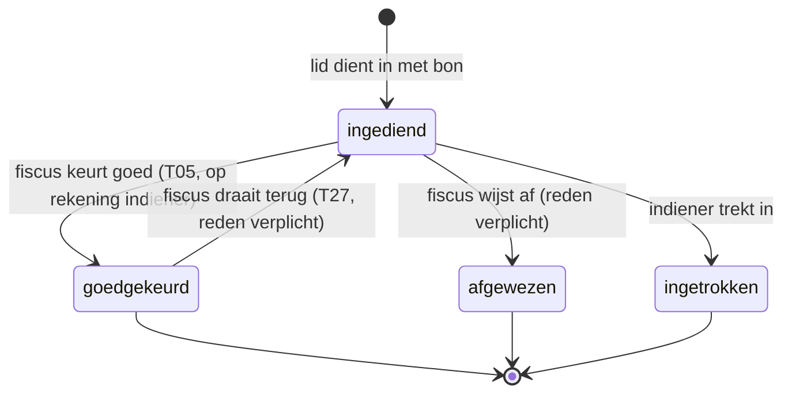
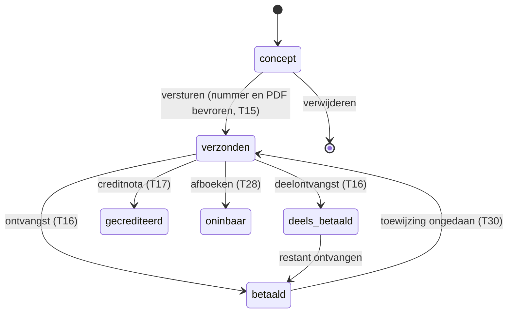
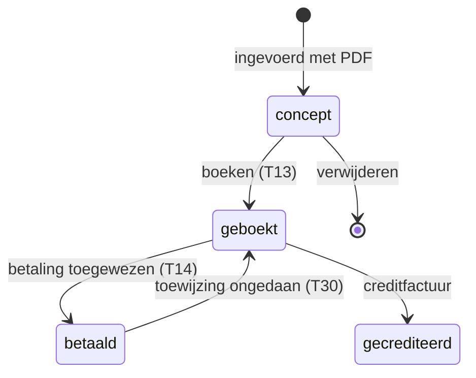
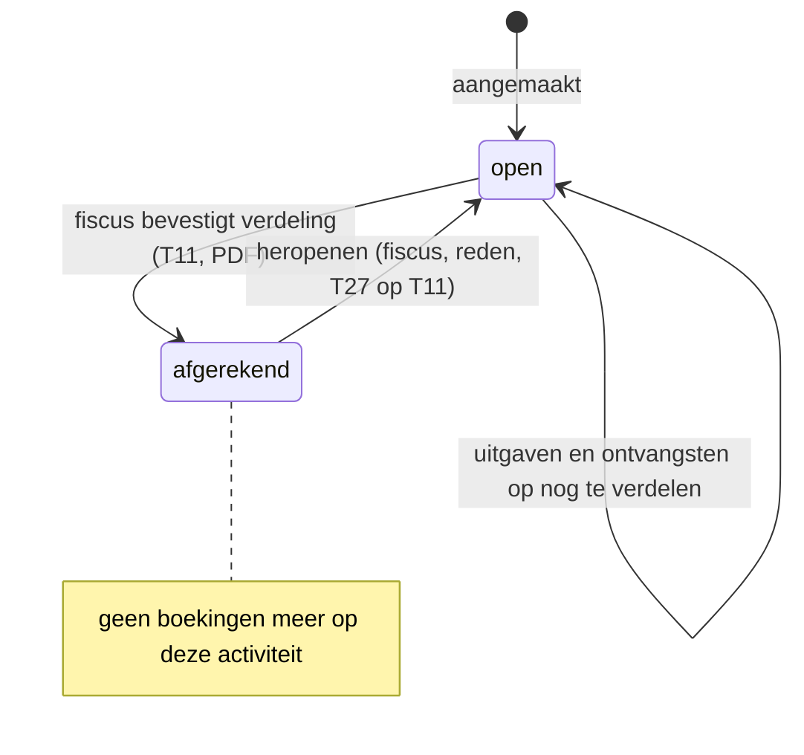
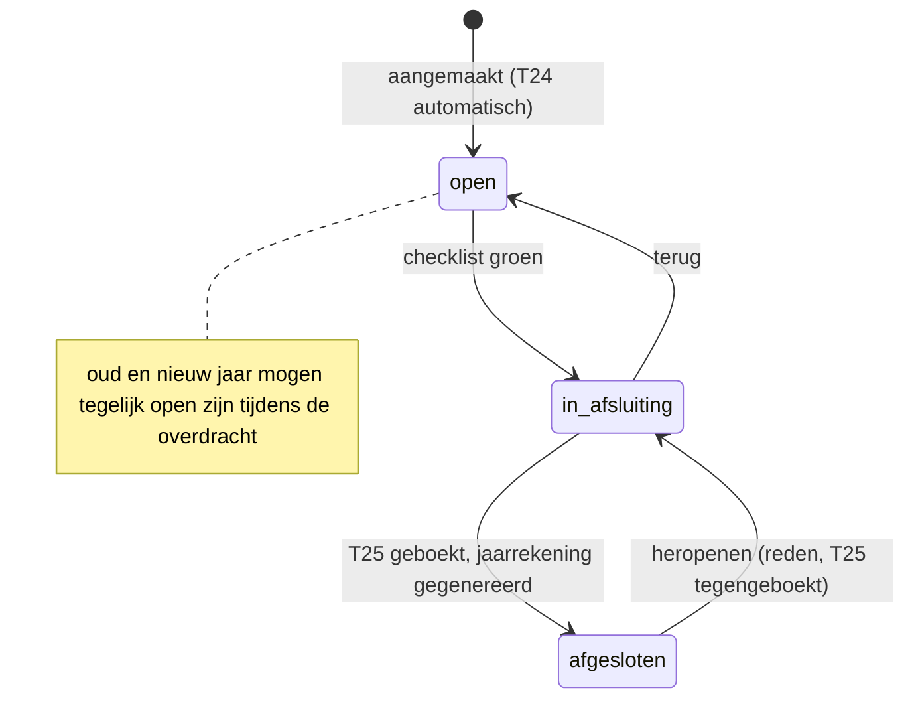

# PLAN — Boekhouding voor een studentendispuut

> Status: **v2, goedgekeurd met de antwoorden van de opdrachtgever** (zie §13 voor het besluitenlog).
> v1 bevatte incasso's, open-post-afletteren en een matching engine met confidence-scores. Die zijn na de antwoorden geschrapt of vereenvoudigd: **het systeem moet klein zijn en áltijd kloppen**.

---

## 0. Het idee in één alinea

Iedereen (lid of extern) heeft een **eigen rekening** bij het dispuut. Alles wat het dispuut voor iemand voorschiet komt daarop (contributie per maand, een deel van de borrel, een deel van de bierfusten, …); alles wat iemand betaalt of declareert gaat eraf. Wie te veel betaalt heeft een **tegoed**. Uitgaven voor een feest dat nog moet komen staan tot die tijd op **"nog te verdelen"** bij die activiteit; bij het afrekenen wordt het bedrag verdeeld over de deelnemers (en eventueel een deel voor het dispuut zelf, uit een potje). Elke maand krijgt elk lid automatisch een mail met zijn/haar rekening en wat er overgemaakt moet worden. De bank is de bron van waarheid: elke bankregel moet een plek krijgen (*"waar geboekt"*), en het dashboard toont hoeveel er nog openstaan.

Onder de motorkap is het gewoon dubbel boekhouden; in de UI zie je alleen **personen, activiteiten, potjes en de bank**.

---

## 1. Kernprincipes

1. **De bank is de bron van waarheid.** Elke banktransactie wordt bij import direct geboekt op *Te verwerken bankmutaties* (1099). Toewijzen verplaatst het bedrag naar een persoon, activiteit, potje, factuur of interne overboeking. "X transacties nog toe te wijzen" = aantal banktransacties met een saldo ≠ 0 op 1099. Nul = de boekhouding is bij. Daardoor is **banksaldo in de app = banksaldo bij de bank, altijd**, ook vóór het toewijzen.
2. **Dubbel boekhouden onder de motorkap.** Elke gebeurtenis maakt één journaalpost waarvan de regels op nul sluiten. Debet/credit is alleen zichtbaar in het scherm *Memoriaal* (fiscus) en voor de kascommissie.
3. **Geboekt = onveranderlijk.** Correcties zijn tegenboekingen. Append-only audit log (wie, wanneer, wat, waarom), met hash-keten. Afgedwongen in de database, niet alleen in code.
4. **Bedragen zijn integers in eurocenten.** Nooit floats, ook niet bij het parsen van bankbestanden.
5. **Import is idempotent.** (IBAN + volgnummer) kan nooit twee keer geboekt worden.
6. **De balans klopt altijd.** Som van alle regels = 0 (dus activa = passiva); grootboeksaldo bank = laatste "saldo na transactie" uit de bankexport; een import die een gat in de saldoketen zou veroorzaken wordt geweigerd.
7. **Geen gokwerk.** De app boekt nooit iets op basis van een waarschijnlijkheid. Automatisch boeken gebeurt alleen bij zekerheid (overboeking tussen eigen rekeningen, of een regel die de fiscus zelf expliciet op "automatisch" heeft gezet). Al het andere is een voorstel dat met één klik bevestigd wordt.

---

## 2. Architectuur

```
src/app/**             routes, pagina's, server actions (auth → Zod → service); NL-UI
src/components/**      UI (Tailwind + shadcn/ui)
src/domain/**          PURE functies, geen I/O: money, journaalpost-templates, verdeling
                       (largest remainder), voorstellen, rapportberekeningen, parsers
src/server/ledger/     postEntry() / reverseEntry(): de énige code die journaal schrijft
src/server/services/   use-cases (importBank, assignTransaction, approveClaim, settleActivity, …)
src/server/bank/       BankConnector-interface + rabobank-csv, camt053 (later psd2)
src/server/db/         Drizzle-schema, migraties (incl. SQL-triggers), seed
src/server/auth/       Auth.js-config, rollen, requireRole()
src/server/pdf|export|mail|storage/
```

Regel: **alle geldmutaties lopen via `postEntry()`** in één DB-transactie samen met de statuswijziging van het document en de audit-logregel.

**Eén dispuut per installatie** (single-tenant). Een nieuw dispuut start zijn eigen installatie (gratis: Vercel Hobby + Neon Free) en doorloopt de **installatiewizard** (§9). Dat houdt de data per dispuut strikt gescheiden en het datamodel simpel.

---

## 3. Datamodel

### 3.1 Conventies

| Onderwerp | Keuze |
|---|---|
| Bedragen | `bigint` eurocenten; in TS branded `Cents` (veilige integer). Parsen via strings. Verdelen met *largest remainder* zodat de som exact klopt. |
| Teken | `journal_line.amount_cents`: **positief = debet, negatief = credit**. Som per post = 0. |
| Persoonsrekening | Saldo > 0 = persoon moet het dispuut betalen; saldo < 0 = tegoed. |
| Sleutels | `uuid` voor entiteiten; `bigserial` voor audit log. |
| Tijd | `timestamptz` voor momenten, `date` voor boekdatum. Tijdzone Europe/Amsterdam. |
| Verwijderen | Financiële data nooit; stamdata krijgt `active`. |
| Btw | `journal_line.vat_code` en `account.default_vat_code`, nullable, nu altijd `NULL`. |

### 3.2 ERD

```mermaid
erDiagram
    FISCAL_YEAR ||--o{ JOURNAL_ENTRY : bevat
    FISCAL_YEAR ||--o{ BUDGET_LINE : begroting
    FISCAL_YEAR ||--o{ ROLE_ASSIGNMENT : "rollen per jaar"
    JOURNAL_ENTRY ||--|{ JOURNAL_LINE : "regels, som = 0"
    JOURNAL_ENTRY |o--o| JOURNAL_ENTRY : "tegenboeking van"
    ACCOUNT ||--o{ JOURNAL_LINE : op
    POT ||--o{ JOURNAL_LINE : "dimensie potje"
    POT ||--o{ BUDGET_LINE : begroot
    ACTIVITY ||--o{ JOURNAL_LINE : "dimensie activiteit"
    PARTY ||--o{ JOURNAL_LINE : "persoonsrekening"
    PARTY ||--o| MEMBER : "is lid"
    PARTY ||--o{ PARTY_IBAN : "bekende IBANs"
    MEMBER_TYPE ||--o{ MEMBER : "soort lid"
    MEMBER ||--o{ CONTRIBUTION_CHARGE : "maand-aanslag"
    MEMBER |o--o| APP_USER : "logt in als"
    APP_USER ||--o{ ROLE_ASSIGNMENT : krijgt

    BANK_ACCOUNT ||--o{ BANK_TRANSACTION : bevat
    BANK_IMPORT ||--o{ BANK_TRANSACTION : importeerde
    BANK_TRANSACTION ||--o{ JOURNAL_LINE : "import- en toewijsposten"
    MATCH_RULE ||--o{ BANK_TRANSACTION : "stelt voor"
    CASH_COUNT }o--|| BANK_ACCOUNT : kas

    ACTIVITY ||--o{ ACTIVITY_SHARE : "verdeling"
    PARTY ||--o{ ACTIVITY_SHARE : deelnemer
    EXPENSE_CLAIM }o--|| PARTY : indiener
    EXPENSE_CLAIM }o--o| ACTIVITY : "op activiteit"
    EXPENSE_CLAIM }o--o| POT : "of op potje"
    PURCHASE_INVOICE }o--|| PARTY : leverancier
    SALES_INVOICE }o--|| PARTY : klant
    SALES_INVOICE ||--|{ SALES_INVOICE_LINE : regels
    SETTLEMENT }o--o| JOURNAL_ENTRY : "boeking indien mutatie"
    ATTACHMENT }o--o{ EXPENSE_CLAIM : bon
    MONTHLY_STATEMENT }o--|| PARTY : "maandmail"
    AUDIT_LOG }o--o| APP_USER : door

    ORG_SETTINGS {
        text name
        text short_name
        text iban_display "voor betaalinstructie"
        int fiscal_year_start_month "standaard 8"
        int statement_day "dag van maandmail, standaard 1"
        bool statement_auto_send
        text mail_from
        bool setup_completed
    }
    FISCAL_YEAR {
        uuid id PK
        text label "2026-2027"
        date start_date
        date end_date
        enum status "open|closing|closed"
        int next_entry_number
    }
    ACCOUNT {
        uuid id PK
        text code UK
        text name
        enum type "asset|liability|equity|income|expense"
        text system_key UK
        bool requires_party
        bool requires_activity
        bool manual_posting_allowed
        bool active
    }
    POT {
        uuid id PK
        text code UK
        text name
        uuid default_income_account_id FK
        uuid default_expense_account_id FK
        bool active
    }
    BUDGET_LINE {
        uuid id PK
        uuid fiscal_year_id FK
        uuid pot_id FK
        enum kind "income|expense"
        bigint amount_cents
        text note
    }
    JOURNAL_ENTRY {
        uuid id PK
        uuid fiscal_year_id FK
        text entry_number UK "2026-000123"
        date entry_date
        text template "T00..T33"
        text description
        text source_type
        uuid source_id
        uuid reverses_entry_id FK
        bool is_automatic
        text reason
        uuid created_by FK
        timestamptz created_at
    }
    JOURNAL_LINE {
        uuid id PK
        uuid entry_id FK
        int line_no
        uuid account_id FK
        bigint amount_cents "+debet -credit"
        uuid pot_id FK "verplicht op resultaatrekening"
        uuid activity_id FK "verplicht op 1350"
        uuid party_id FK "verplicht op 1300/1310/1600"
        uuid bank_transaction_id FK
        uuid invoice_id "verkoop- of inkoopfactuur"
        text description
        text vat_code
    }
    PARTY {
        uuid id PK
        enum kind "member|external"
        text name
        text email
        bool active
    }
    PARTY_IBAN {
        uuid party_id FK
        text iban UK
    }
    MEMBER_TYPE {
        uuid id PK
        text name "zelf aan te maken"
        bigint monthly_contribution_cents
        bool active
    }
    MEMBER {
        uuid party_id PK
        uuid member_type_id FK
        text first_name
        text last_name
        int cohort "jaargang"
        date joined_on
        date left_on
    }
    CONTRIBUTION_CHARGE {
        uuid id PK
        uuid member_id FK
        date month "eerste dag, UK met member"
        bigint amount_cents
        uuid entry_id FK
    }
    APP_USER {
        uuid id PK
        text email UK
        uuid party_id FK
    }
    ROLE_ASSIGNMENT {
        uuid id PK
        uuid user_id FK
        uuid fiscal_year_id FK
        enum role "fiscus|bestuur|kascommissie"
    }
    BANK_ACCOUNT {
        uuid id PK
        text iban UK "null voor kas"
        text name
        enum kind "checking|savings|cash"
        uuid ledger_account_id FK
    }
    BANK_IMPORT {
        uuid id PK
        text format
        text file_sha256
        int count_new
        int count_duplicate
    }
    BANK_TRANSACTION {
        uuid id PK
        uuid bank_account_id FK
        text external_id "Volgnr"
        date booking_date
        bigint amount_cents
        bigint balance_after_cents
        text counterparty_iban
        text counterparty_name
        text description
        jsonb raw
    }
    MATCH_RULE {
        uuid id PK
        text name
        text counterparty_iban "exact"
        text description_contains "exact, hoofdletterongevoelig"
        enum direction "in|out|both"
        jsonb target "persoon|activiteit|potje"
        bool auto_book "alleen als fiscus dit expliciet aanzet"
    }
    ACTIVITY {
        uuid id PK
        uuid fiscal_year_id FK
        text name
        date held_on
        uuid pot_id FK "potje voor dispuutsdeel"
        enum status "open|settled"
        uuid settlement_entry_id FK
    }
    ACTIVITY_SHARE {
        uuid activity_id FK
        uuid party_id FK "null = dispuut zelf"
        enum method "equal|weight|fixed"
        int weight "bv. aantal streepjes"
        bigint fixed_cents
    }
    EXPENSE_CLAIM {
        uuid id PK
        uuid party_id FK
        bigint amount_cents
        uuid activity_id FK
        uuid pot_id FK
        text description
        enum status "submitted|approved|rejected|withdrawn"
        text rejection_reason
        uuid entry_id FK
    }
    MONTHLY_STATEMENT {
        uuid id PK
        uuid party_id FK
        date month "UK met party"
        bigint opening_cents
        bigint closing_cents
        enum status "draft|sent|held"
    }
    AUDIT_LOG {
        bigint id PK
        timestamptz occurred_at
        uuid actor_user_id FK
        text action
        text entity_type
        text entity_id
        jsonb data
        text reason
        text prev_hash
        text hash
    }
```



Niet in het ERD: Auth.js-tabellen (`user`-koppeling, `session`, `verification_token`), `attachment` + `attachment_link`, `purchase_invoice`, `sales_invoice(_line)`, `cash_count`, `settlement`, `email_outbox`.

### 3.3 Invarianten en afdwinging

| # | Invariant | Afdwinging |
|---|---|---|
| I1 | Som regels per journaalpost = 0, minstens 2 regels | Deferred constraint trigger + check in `postEntry()` + property-test |
| I2 | Journaal, audit log en banktransacties zijn onveranderlijk | `BEFORE UPDATE OR DELETE` trigger die altijd faalt |
| I3 | Boeken alleen in boekjaar `open` (of `closing` voor afsluitposten), datum binnen boekjaar | Trigger |
| I4 | Resultaatrekening ⇒ potje verplicht; balansrekening ⇒ geen potje; `requires_party` ⇒ persoon; `requires_activity` ⇒ activiteit | Trigger + Zod |
| I5 | Bank, kas, 1099, 1090 en 0590 alleen via systeemtemplates | `manual_posting_allowed = false`, check in `postEntry()` |
| I6 | Banktransactie uniek per (rekening, volgnr) | `UNIQUE` + `ON CONFLICT DO NOTHING`; afwijkende inhoud bij zelfde sleutel = harde fout |
| I7 | Grootboeksaldo bankrekening = `balance_after` laatste transactie | Continuïteitscheck bij import, anders rollback |
| I8 | Activa = passiva | Volgt uit I1; getest op balansrapport + property-test |
| I9 | Journaalnummers gapless per boekjaar | Teller op `fiscal_year`, `FOR UPDATE` |
| I10 | Afgerekende activiteit ⇒ geen nieuwe regels op die activiteit; saldo 1350 van die activiteit = 0 | Trigger + check bij afrekenen |
| I11 | Audit log manipulatie-evident | `hash = sha256(prev_hash ‖ data)`; verificatie in kascommissie-scherm |
| I12 | Contributie max. één keer per lid per maand | `UNIQUE (member_id, month)` |

---

## 4. Rekeningschema (seed; uitbreidbaar via beheer)

### 4.1 Balans

| Code | Naam | Type | Systeemsleutel | Verplicht | Handmatig |
|---|---|---|---|---|---|
| 0500 | Algemene reserve | equity | `GENERAL_RESERVE` | – | ja |
| 0510 | Bestemmingsreserve lustrum | equity | – | – | ja |
| 0520 | Bestemmingsreserve huisfonds | equity | – | – | ja |
| 0590 | Resultaat boekjaar (afsluitrekening) | equity | `YEAR_RESULT` | – | nee |
| 1000 | Betaalrekening | asset | `BANK` | – | nee |
| 1010 | Spaarrekening | asset | `BANK` | – | nee |
| 1050 | Kas | asset | `CASH` | – | nee |
| 1090 | Interne overboekingen onderweg | asset | `INTERNAL_TRANSFER` | – | nee |
| 1099 | Te verwerken bank- en kasmutaties | asset | `BANK_SUSPENSE` | – | nee |
| 1300 | Rekeningen leden | asset | `MEMBER_ACCOUNTS` | persoon | ja |
| 1310 | Rekeningen externen (debiteuren overig) | asset | `EXTERNAL_ACCOUNTS` | persoon | ja |
| 1350 | Nog te verdelen (activiteiten) | asset | `TO_DISTRIBUTE` | activiteit | ja |
| 1320 | Nog te ontvangen bedragen | asset | `ACCRUED_INCOME` | – | ja |
| 1400 | Vooruitbetaalde kosten | asset | `PREPAID_EXPENSES` | – | ja |
| 1600 | Crediteuren | liability | `ACCOUNTS_PAYABLE` | persoon | ja |
| 1700 | Nog te betalen kosten | liability | `ACCRUED_EXPENSES` | – | ja |
| 1730 | Vooruitontvangen bedragen | liability | `DEFERRED_INCOME` | – | ja |

Presentatie op de balans: rekeningen 1300/1310 worden per persoon bekeken; **positieve saldi** staan onder *vorderingen*, **negatieve saldi (tegoeden)** onder *schulden* ("tegoeden leden"). Zo is de balans correct zonder dat de gebruiker twee rekeningen hoeft te snappen. "Resultaat lopend boekjaar" is een berekende regel.

### 4.2 Resultaat

| Code | Naam | Type | Standaardpotje |
|---|---|---|---|
| 8000 | Contributie | income | Contributie |
| 8100 | Sponsoring | income | Sponsoring |
| 8110 | Donaties en giften | income | Algemeen |
| 8400 | Verhuur | income | Huisvesting |
| 8800 | Rente | income | Algemeen |
| 8900 | Overige baten | income | Algemeen |
| 8950 | Onttrekking bestemmingsreserves | income | Reserveringen |
| 4000 | Kosten borrels (dispuutsdeel) | expense | Borrels |
| 4100 | Huisvesting | expense | Huisvesting |
| 4200 | Kosten activiteiten (dispuutsdeel) | expense | Activiteiten |
| 4300 | Kosten lustrum | expense | Lustrum |
| 4400 | Bestuurskosten | expense | Bestuur |
| 4500 | Bankkosten | expense | Bank |
| 4600 | Kosten ALV | expense | ALV |
| 4700 | Representatie en cadeaus | expense | Bestuur |
| 4800 | Kas- en afrondingsverschillen | expense | Algemeen |
| 4850 | Oninbare vorderingen | expense | Algemeen |
| 4900 | Dotatie bestemmingsreserves | expense | Reserveringen |
| 4990 | Overige kosten | expense | Algemeen |

Resultaatrekeningen met een vaste rol hebben ook een systeemsleutel: 8000 `CONTRIBUTION`, 8950 `RESERVE_WITHDRAWAL`, 4800 `CASH_DIFFERENCES`, 4850 `BAD_DEBTS`, 4900 `RESERVE_DOTATION`.

### 4.3 Potjes

Contributie · Sponsoring · Borrels · Huisvesting · Activiteiten · Lustrum · Bestuur · ALV · Bank · Reserveringen · Algemeen. Elk potje heeft een standaard baten- en lastenrekening; in de UI kies je alleen het potje. Begroting per potje per boekjaar (baten en lasten). **Reserveren via de begroting**: begrotingsregel op potje *Reserveringen* (lasten); de dotatie (T20) boekt die kosten en zet het bedrag in de bestemmingsreserve.

---

## 5. Journaalpost-templates

**D** = debet, **C** = credit. Dimensies: `pot`, `act`, `party`, `btx` (banktransactie), `inv` (factuur). Elke template is een pure functie `(input) → EntryDraft` in `src/domain/ledger/templates.ts` met eigen unit test.

| # | Gebeurtenis | Regels | Opmerking |
|---|---|---|---|
| T00 | Banktransactie geïmporteerd (bedrag *b*, bij) | D 1000 *b* (btx) · C 1099 *b* (btx) | Af: tekens om. Altijd, automatisch. |
| T01 | Contributie maand | D 1300 *c* (party) · C 8000 *c* (pot Contributie) | Op de 1e van de maand per actief lid, tarief van diens soort lid. Uniek per lid+maand. Geen boekjaargrens-probleem: een maand valt altijd in één boekjaar. |
| T02 | Betaling van persoon (bank) | D 1099 *b* (btx) · C 1300/1310 *b* (party) | Te veel betaald ⇒ saldo wordt negatief = tegoed. |
| T03 | Terugbetaling aan persoon (bank) | D 1300/1310 *b* (party) · C 1099 *b* (btx) | Bv. tegoed of goedgekeurde declaratie uitbetalen. |
| T04 | Declaratie ingediend | *geen boeking* | |
| T05 | Declaratie goedgekeurd | D 1350 *d* (act) **of** D 4xxx *d* (pot) · C 1300 *d* (party indiener) | Komt als tegoed op de rekening van de indiener; verrekend met wat hij/zij verschuldigd is. |
| T06 | Declaratie afgewezen / ingetrokken | *geen boeking* | Na goedkeuring terugdraaien = T27. |
| T07 | Uitgave voor activiteit (bank) — "bierfusten voor het feest" | D 1350 *k* (act) · C 1099 *k* (btx) | Staat tot afrekenen als "nog te verdelen". |
| T08 | Uitgave dispuut (bank) | D 4xxx *k* (pot) · C 1099 *k* (btx) | |
| T09 | Ontvangst dispuut (bank), bv. sponsoring, rente | D 1099 *b* (btx) · C 8xxx *b* (pot) | |
| T10 | Ontvangst voor activiteit (bank), bv. kaartverkoop | D 1099 *b* (btx) · C 1350 *b* (act) | Verlaagt het te verdelen bedrag. |
| T11 | **Activiteit afrekenen (verdelen)** | C 1350 *S* (act) · D 1300/1310 *sᵢ* (party, act) per deelnemer · D 4xxx *s₀* (pot van activiteit) voor dispuutsdeel | *S* = volledig saldo te verdelen; Σ*sᵢ* + *s₀* = *S* exact (largest remainder). Methoden: gelijk, naar gewicht (bv. streepjes bij de borrel), vast bedrag, mix. Negatief *S* (overschot) wordt op dezelfde manier teruggegeven. Daarna is de activiteit gesloten. |
| T12 | Op rekening zetten (los bedrag) | D 1300/1310 *x* (party) · C 1350 (act) of C 8xxx (pot) | Bv. boete, kaartje, iets wat iemand kocht van het dispuut. |
| T13 | Inkoopfactuur ontvangen | D 4xxx (pot) of D 1350 (act) · C 1600 (party, inv) | |
| T14 | Inkoopfactuur betaald (bank) | D 1600 (party, inv) · C 1099 (btx) | |
| T15 | Verkoopfactuur verstuurd | D 1310 (party, inv) · C 8xxx per regel (pot) | Nummer gapless, PDF bevroren. |
| T16 | Verkoopfactuur ontvangen (bank) | D 1099 (btx) · C 1310 (party, inv) | |
| T17 | Creditnota | spiegel van T15 | |
| T18 | Interne overboeking, uitgaande kant | D 1090 · C 1099 (btx) | Automatisch: tegenrekening is eigen IBAN. |
| T18b | Interne overboeking, inkomende kant | D 1099 (btx) · C 1090 | 1090 is 0 als beide kanten binnen zijn. |
| T19 | Kasmutatie (handmatig ingevoerd) | D/C 1050 · C/D 1099 (btx kas) → daarna toewijzen als bank | Kas = "bankrekening zonder import". Kas ↔ bank loopt via 1090. |
| T20 | Kastelling met verschil | Tekort: D 4800 (pot Algemeen) · C 1050; overschot omgekeerd | |
| T21 | Dotatie bestemmingsreserve | D 4900 (pot Reserveringen) · C 05x0 | Volgens begroting. |
| T22 | Onttrekking bestemmingsreserve | D 05x0 · C 8950 (pot Reserveringen) | Bv. lustrum betalen uit lustrumfonds. |
| T23 | Overlopende post boekjaareinde | memoriaal met `auto_reverse` | Tegenboeking (T24) automatisch op dag 1 van het nieuwe jaar. |
| T24 | Automatische tegenboeking overlopende post | spiegel T23 | |
| T25 / T25b | Jaarafsluiting | T25: elk resultaatsaldo per rekening×potje naar 0590; T25b (resultaatbestemming): D 0590 · C 0500 (of verdeeld over reserves; bij verlies omgekeerd) | Status `closing`, datum = laatste dag. |
| T26 | Beginbalans (installatiewizard) | D bank/kas (= saldo bij de bank), D/C 1300/1310 per persoon, D 1350 per open activiteit, C 1600, C reserves; verschil → 0500 | Enige manier om bank/kas buiten import te muteren; controle: banksaldo = saldo vóór eerste te importeren regel. |
| T27 | Correctie (tegenboeking) | exacte spiegel, `reverses_entry_id` | Reden verplicht, max. één keer per post. |
| T28 | Afboeken oninbaar | D 4850 (pot Algemeen) · C 1300/1310 (party) | Reden verplicht. |
| T29 | Memoriaal | vrij, som 0, niet op systeemrekeningen | Alleen fiscus, reden verplicht. |
| T30 | Toewijzing ongedaan maken | T27 op de toewijzingspost | Banktransactie weer "toe te wijzen". |
| T31 | Split-toewijzing | combinatie van T02/T07/T08/T09/T10 in één post | Eén bankregel, meerdere bestemmingen; UI telt af tot €0,00. |

Ledenafrekening (bij uitschrijven), commissie-afrekening en bestuursafrekening zijn **rapporten + bevroren PDF**; ze boeken alleen iets als er echt geld verschuift (bv. afboeken T28).

---

## 6. Bank

### 6.1 `BankConnector`

```ts
interface BankConnector {
  readonly id: 'rabobank_csv' | 'camt053' | 'psd2';
  fetchTransactions(account: BankAccountRef, since: LocalDate): Promise<FetchResult>;
}
interface FetchResult {
  transactions: NormalizedBankTransaction[];
  statementBalances: { date: LocalDate; openingCents?: Cents; closingCents: Cents }[];
  warnings: string[];
}
```

Bestandsconnectoren krijgen het bestand in de constructor. De importservice is connector-agnostisch: dedupe → continuïteitscheck → T00 → voorstellen → audit log. Een PSD2-aggregator (Enable Banking / GoCardless) is later een extra implementatie.

### 6.2 Rabobank CSV

Kolommen op **naam** (niet positie): `IBAN/BBAN, Munt, BIC, Volgnr, Datum, Rentedatum, Bedrag, Saldo na trn, Tegenrekening IBAN/BBAN, Naam tegenpartij, …, Transactiereferentie, …, Betalingskenmerk, Omschrijving-1..3, Reden retour, …`. UTF-8 (met/zonder BOM) of Windows-1252; bedragen `+1.234,56` → centen via string. Meerdere rekeningen per bestand; `externalId = Volgnr`.

### 6.3 CAMT.053

`camt.053.001.02` (Rabobank), tolerant voor latere versies. Per statement: IBAN, OPBD/CLBD; per entry: bedrag + richting, boekdatum, `AcctSvcrRef`, tegenpartij, omschrijving. Continuïteit via OPBD/CLBD. Omdat er geen echte voorbeeldbestanden zijn, worden de fixtures synthetisch opgebouwd volgens de publieke specificatie en als zodanig gemarkeerd. Per bankrekening wordt vastgelegd welk formaat gebruikt wordt; CSV en CAMT door elkaar voor dezelfde rekening wordt geweigerd (want de volgnummers zijn niet gegarandeerd gelijk).

### 6.4 Importregels

1. Zelfde bestand opnieuw = "0 nieuw, N al aanwezig".
2. Per transactie `ON CONFLICT DO NOTHING`; zelfde sleutel met andere inhoud = fout.
3. Saldo vóór de eerste nieuwe regel moet = grootboeksaldo, anders weigeren met "ontbrekende transacties tussen … en …".
4. T00 per nieuwe transactie; daarna voorstellen (§7).
5. Na import: grootboeksaldo = laatste `Saldo na trn`/CLBD, anders rollback.

### 6.5 Tikkie

Tikkie-betalingen komen binnen van tegenpartij "Tikkie"/ABN AMRO met in de omschrijving de naam en IBAN van de betaler. De voorstel-logica haalt die IBAN/naam uit de omschrijving, zodat een Tikkie-betaling net zo makkelijk aan een persoon wordt gekoppeld als een gewone overboeking. De app maakt geen Tikkies zelf aan (Tikkie-API is niet gratis); ze toont per externe het bedrag en een kopieerbare tekst.

---

## 7. Toewijzen ("waar geboekt")

Het toewijzen-scherm is de kern: links de lijst **Nog toe te wijzen (X)** met *bij/af*, *bedrag*, *tegenpartij*, *omschrijving*; rechts de keuze **Waar geboekt?**

- **Persoon** (lid of extern) → T02/T03
- **Activiteit** (nog te verdelen) → T07/T10
- **Potje** (kosten/opbrengsten van het dispuut) → T08/T09
- **Factuur** (openstaande inkoop-/verkoopfactuur) → T14/T16
- **Interne overboeking** → T18/T18b
- **Splitsen** → T31

**Voorstellen** zijn deterministisch en worden alleen voorgevuld; bevestigen is één klik:

| Voorstel | Wanneer | Automatisch geboekt? |
|---|---|---|
| Interne overboeking | tegenrekening is een eigen IBAN | **ja** (100% zeker), gemarkeerd "automatisch" |
| Persoon | tegenrekening-IBAN (of IBAN in Tikkie-omschrijving) hoort bij precies één persoon | nee |
| Regel | een door de fiscus gemaakte regel (exacte IBAN en/of exacte tekst) | alleen als de fiscus die regel zelf op "automatisch" zette |
| Zelfde als vorige keer | exact dezelfde tegenrekening-IBAN én dezelfde bestemming de vorige keer | nee |

Bij een onbekende IBAN die aan een persoon wordt toegewezen vraagt de app "IBAN onthouden voor Jan?" zodat het volgende keer voorgesteld wordt. Elke automatische of bevestigde toewijzing kan worden teruggedraaid (T30).

---

## 8. Leden, contributie, maandmail, declaraties, activiteiten

**Soorten leden** maakt de fiscus zelf aan (naam + contributie per maand, bv. "Lid € 15", "Aspirant € 10", "Oud-lid € 5", "Reünist € 0"). Elk lid heeft één soort.

**Contributie**: dagelijkse job (Vercel Cron, gratis) boekt op de 1e van de maand T01 voor elk lid dat die dag actief is. Idempotent (I12). Ook handmatig te starten ("contributie september boeken") en in te halen voor gemiste maanden.

**Maandmail (debiteurenlijst)**: op `statement_day` maakt de app per persoon (leden, en externen met een saldo) een overzicht: beginsaldo, alle mutaties van de maand (contributie, aandelen in activiteiten, declaraties, betalingen), eindsaldo, en *"Maak € X over naar NL.. t.n.v. … o.v.v. je naam"* of *"Je hebt een tegoed van € X"*. **Veiligheid**: wordt alleen automatisch verstuurd als de boekhouding bij is (0 transacties toe te wijzen); anders blijft hij als concept staan en krijgt de fiscus een melding. De fiscus kan altijd eerst een voorbeeld bekijken. Verzending via gratis SMTP (bv. Gmail met app-wachtwoord of Brevo free tier); lokaal Mailpit.

**Declaraties**: lid dient in (bedrag, activiteit óf potje, omschrijving, foto/PDF van de bon). Fiscus keurt goed (T05) of wijst af met reden. Goedgekeurd = bijgeschreven op de rekening van de indiener. Geen vier-ogen-controle (goedkeuringen gebeuren vaak fysiek in vergaderingen).

**Activiteiten**: naam, datum, potje (voor het dispuutsdeel). Alles wat ervoor wordt uitgegeven of ontvangen (bank, declaraties, inkoopfacturen) komt op "nog te verdelen". **Afrekenen**: kies deelnemers (leden en externen), methode per deelnemer (gelijk / gewicht / vast bedrag) en optioneel een dispuutsdeel; de app laat zien wat iedereen betaalt, tot op de cent kloppend. Bevestigen boekt T11, maakt de afrekening-PDF en sluit de activiteit. Borrels werken hetzelfde: per borrel (of per maand) een activiteit, verdelen naar streepjes of gelijk.

**Externen** (andere disputen, sponsoren, leveranciers): eigen rekening zoals leden. Voor een ander dispuut dat mee-deed: één regel op hun rekening; zij regelen onderling de verdeling.

---

## 9. Installatiewizard (nieuw dispuut)

Bij de eerste start (`setup_completed = false`) en alleen voor de eerste gebruiker:
1. Naam dispuut, e-mailadres fiscus (wordt de eerste fiscus), startmaand boekjaar (standaard augustus).
2. Bankrekeningen (IBAN + naam; betaal, spaar, kas).
3. Soorten leden met maandcontributie.
4. Leden (handmatig of plakken uit een spreadsheet: naam, e-mail, soort, jaargang, IBAN).
5. **Beginsituatie** (T26): saldo per bankrekening en kas op de startdatum, openstaand saldo per persoon, reserves; eventuele open activiteiten met te verdelen bedrag. Het verschil gaat naar de algemene reserve; de wizard toont de beginbalans ter controle.
6. Rekeningschema en potjes worden met de standaard gevuld (later aan te passen).

---

## 10. Rollen

Rollen per boekjaar, zodat bestuursoverdracht één handeling is ("nieuw bestuur" voor het nieuwe boekjaar). De vorige fiscus houdt de rol op het oude jaar om dat af te sluiten.

| | Fiscus (beheerder) | Bestuur | Lid | Kascommissie |
|---|---|---|---|---|
| Alles inzien | ✔ | ✔ | eigen rekening + eigen declaraties | ✔ incl. audit log en bijlagen |
| Bank importeren, toewijzen, activiteiten, facturen, leden | ✔ | ✔ | – | – |
| Declaratie indienen | ✔ | ✔ | ✔ | – |
| Declaratie goedkeuren/afwijzen | ✔ | – | – | – |
| Activiteit definitief afrekenen | ✔ | – (voorbereiden mag) | – | – |
| Memoriaal, tegenboeking, beginbalans | ✔ | – | – | – |
| Boekjaar afsluiten/heropenen | ✔ | – | – | – |
| Instellingen, rollen, soorten leden | ✔ | – | – | – |
| Iets wijzigen | ✔ | ✔ (zie boven) | eigen declaraties | **nooit** |

Iedereen met een lidmaatschap kan inloggen (e-mail magic link, Auth.js). Alleen e-mailadressen die bekend zijn in de ledenlijst (of als gebruiker zijn toegevoegd) kunnen inloggen. Autorisatie in elke server action via `requireRole()`; geen UI-only checks.

---

## 11. Statusdiagrammen

### 11.1 Declaratie



### 11.2 Verkoopfactuur



### 11.3 Inkoopfactuur



### 11.4 Activiteit



### 11.5 Boekjaar



**Afsluitchecklist**: (1) alle banktransacties van het jaar toegewezen; (2) bankimport loopt tot na het jaareinde; (3) kas geteld; (4) 1090 = 0; (5) geen declaraties `ingediend`; (6) alle activiteiten van het jaar afgerekend (of bewust doorgeschoven: het te verdelen bedrag blijft dan gewoon op de balans staan); (7) overlopende posten beoordeeld; (8) vorig boekjaar afgesloten; (9) resultaatbestemming ingevuld.

---

## 12. Rapportages

Per boekjaar met vergelijking vorig jaar; PDF (@react-pdf/renderer) en Excel (exceljs).

1. **Debiteurenlijst** — per persoon saldo (moet betalen / tegoed), plus "nog te verdelen" per open activiteit. Dit is het dagelijkse werkoverzicht.
2. **Balans** — met specificatie per post.
3. **Resultatenrekening** — per potje: baten, lasten, begroting, verschil.
4. **Kasstroomoverzicht** — per rekening: begin, in, uit, eind.
5. **Ledensaldi / rekening-courant per persoon** (ook de ledenafrekening bij uitschrijven).
6. **Begroting volgend jaar** — invoer naast realisatie en begroting dit jaar.
7. **Kascommissie-pakket (zip)** — journaal, bankregels met toewijzing, grootboekkaarten, audit log met hash-verificatie, bijlagen, afrekening-PDF's.
8. **ALV-jaarrekening** — één PDF: balans, resultaat vs begroting, toelichting per potje, reserves, begroting volgend jaar.

---

## 13. Besluitenlog (antwoorden opdrachtgever, v1 → v2)

| # | Vraag | Besluit |
|---|---|---|
| 1 | Boekjaar | Gelijk aan bestuurs-/collegejaar; start instelbaar, standaard **1 augustus**. |
| 2 | Contributie | **Per maand**; soorten leden **zelf aan te maken** met eigen maandbedrag. |
| 3 | Goedkeuren | **Fiscus** keurt alles goed en is beheerder. Geen vier-ogen-controle. |
| 4 | Reserves | Reserveren via de begroting (potje Reserveringen, T21). Onttrekken via T22. |
| 5 | Borrels | Achteraf verdelen over de aanwezigen (gelijk of naar streepjes) op ieders eigen rekening; externen/andere disputen krijgen één bedrag (Tikkie), regelen onderling. |
| 6 | Commissie-/bestuursafrekening | PDF + audit log, geen boeking zonder mutatie. |
| 7 | Te veel betaald | Wordt **tegoed** (negatief saldo op eigen rekening). |
| 8 | Matching | **Geen** confidence/fuzzy matching. Alleen zekere voorstellen; automatisch alleen interne overboekingen en expliciet door fiscus aangezette regels. |
| 9 | Voorbeeldbestanden | Niet beschikbaar → synthetische fixtures volgens publiek formaat. Toewijzen-scherm volgt de bestaande werkwijze: *bij/af · bedrag · waar geboekt*. |
| 10 | Kenmerk | Geen kenmerk met controlecijfer. Leden betalen "o.v.v. naam"; herkenning via bekende IBAN. Facturen hebben hun factuurnummer. |
| 11 | Potjes als dimensie | Akkoord. |
| 12 | Incasso | **Geen incasso** (PAIN.008 geschrapt). Wel automatische **maandmail** per persoon met saldo en betaalinstructie. |
| 13 | Start | **Installatiewizard** met instelbare beginsituatie; geschikt voor nieuwe disputen. |
| 14 | E-mail/hosting | **Alleen gratis**: SMTP naar keuze (Gmail app-wachtwoord / Brevo free), Vercel Hobby, Neon Free; bijlagen in S3-compatibele opslag (MinIO lokaal, Supabase Storage free) met beeldcompressie. |
| 15 | Inloggen | Iedereen. Lid: eigen rekening + declaraties. Bestuur: alles inzien en bewerken. Kascommissie: alles inzien, niets wijzigen. |
| – | Werkwijze debiteurenlijst | Uitgaven vooruit (bierfusten) staan op **nog te verdelen** bij de activiteit; bij afrekenen naar de rekeningen van deelnemers (en externen). Tot betaald = debiteur. |
| – | Commissievoorzitter-rol | Voorlopig geschrapt (niet genoemd); later toe te voegen als rol met één potje. |

---

## 14. Bouwvolgorde

| Stap | Oplevering |
|---|---|
| a | Project-setup, docker-compose (Postgres, MinIO, Mailpit), Drizzle-schema + SQL-triggers, Auth.js magic link, rollen, seed (voorbeelddispuut: ~40 leden, soorten leden, rekeningschema, potjes; boekjaar 2025-2026 afgesloten, 2026-2027 lopend) |
| b | `postEntry()`/`reverseEntry()`, templates als pure functies, invariant- en property-tests, journaal/grootboek/debiteurenlijst-schermen |
| c | BankConnector, Rabobank CSV + CAMT.053, idempotentie, continuïteit, interne overboekingen |
| d | Toewijzen-scherm + deterministische voorstellen + regels |
| e | Leden, soorten leden, maandcontributie (cron), maandmail |
| f | Declaraties met bon-upload; inkoop- en verkoopfacturen |
| g | Activiteiten + verdelen/afrekenen met PDF; leden-, commissie- en bestuursafrekening |
| h | Kasboek + kastelling, memoriaal-UI, bestemmingsreserves |
| i | Rapportages, jaarafsluiting met checklist, kascommissie-pakket, ALV-jaarrekening, installatiewizard afgerond |

## 15. Aanvullingen v3 (feedback op het prototype)

| Onderwerp | Besluit |
|---|---|
| Contributie | Leden maken hun contributie **zelf maandelijks over**. De maandelijkse aanslag (T01) komt op een aparte **contributierekening per lid** (1305 *Contributie te ontvangen*), los van de rekening voor borrels/activiteiten (1300). Betalingen worden toegewezen als "Contributie van lid"; het overzicht verrekent betalingen met de oudste maand eerst (betaald / deels / open per maand). Bulk-toewijzen van contributiebetalingen. |
| Verdeling contributie | Contributie is inkomsten (rekening 8000) die met een **verdeelsleutel** (gehele gewichten, bijv. procenten) over potjes wordt verdeeld bij het opleggen (largest remainder, exact tot op de cent). Wijzigen geldt voor volgende maanden. |
| Spaarplannen | Leden sparen bij het dispuut per **spaardoel** (bijv. Lustrumreis 2028). Spaargeld is een schuld aan het lid: rekening 1740 *Spaartegoeden leden* met dimensie `savings_goal_id`. Inleg/uitbetaling via bank (T33); inzetten voor wat het lid moet betalen via T32 (1740 → 1300), per lid of voor iedereen tegelijk (nooit meer dan gespaard). Advies-maandbedrag toont of iemand op schema ligt. |
| Donaties | Potje **Donaties** (8110). Bij toewijzen kan de gever worden vastgelegd (`related_party_id`, informatief, telt nooit mee in persoonssaldi); rapport "donaties per gever". |
| Begroting | Begrotingsregels met eigen omschrijving per potje en soort (baten/lasten), meerdere regels per potje; kopiëren van vorig jaar (begroting of realisatie); verwachte contributie automatisch berekenen; eigen potjes toevoegen. |
| Activiteiten | Vast **nummer per boekjaar** (`A26-001`), zoekbaar en bruikbaar als betaalomschrijving. |
| Externen | Eigen pagina met saldo, betaalverzoektekst (Tikkie/WhatsApp/mail) en "bedrag erop zetten"; externe direct aanmaken vanuit een bankregel of tijdens het afrekenen. |
| Handmatige banktransacties | Toe te voegen zonder bankbestand (`manual`). Een latere import koppelt een bankregel met hetzelfde bedrag en ≤ 3 dagen verschil aan de handmatige transactie in plaats van dubbel te boeken; een handmatige transactie die niet in het bankbestand staat blokkeert de import met uitleg. Saldocontrole: grootboek − nog onbevestigde handmatige transacties = laatste banksaldo. |
| Voorstellen | Deterministisch uitgebreid: omschrijving met "contributie" → contributie; "spaar/sparen" → spaarplan; bedrag = open contributie of veelvoud van het maandtarief → contributie. Nooit automatisch geboekt. |

Nieuwe templates: **T32** spaargeld verrekend (D 1740 party+doel · C 1300 party), **T33** inleg/uitbetaling spaarplan (1099 ↔ 1740). T01 debiteert nu 1305 en verdeelt de baten over potjes.

## 16. Aanvullingen v4 (werkwijze We know You know, uit hun Excel)

Geanalyseerd: Balans 01-08, Financiën BJ25-26 (bankmaanden, Activiteiten, Ledenrekening per maand, Contributie
begroot/betaald, sparen lustrum, Balla bijdrage), Begroting BJ26-27 (Begroting, Contributie & ledenplanning,
Huur & Bier) en het Financieel jaarverslag 25-26. De processen blijven gelijk; de app volgt ze:

| Werkwijze in Excel | In de app |
|---|---|
| ING-export per maand (NL- en EN-kolommen, zonder volgnummer) | **ING CSV-lezer** (`src/domain/bank/ing-csv.ts`): `;` en `,`, met of zonder "Saldo na mutatie". Idempotentiesleutel = hash van datum, bedrag, tegenrekening, naam, mededeling + teller voor gelijke regels op één dag. Met saldokolom sluit de import aan op de beginbalans. |
| Contributie & ledenplanning: per lid per maand jongerejaars / buitenland / ouderejaars / nieuwe lichting / afwezig | **Ledenplanning** (`memberPlanning`, State v3): soort lid per lid per maand, overschrijft de standaardsoort; null = afwezig. Opgelegde maanden liggen vast. |
| Contributie = algemeen deel + woonkamer (5,50 / 3,50) + bier (15,00); nieuwe lichting: rest naar truien | Per **soort lid vaste delen per potje** + een **rest-potje** (`split`, `restPotId`); T01 verdeelt exact zo. |
| Begroting: tarief = posten alle leden ÷ lid-maanden + jongerejaarsposten ÷ jongerejaars/buitenland-maanden + vaste delen | **Contributie berekenen uit de begroting** (`calculateRates`): per begrotingsregel "betaald door" (alle leden / jongerejaars / vaste bijdrage), per soort "betaalt mee aan"; exacte integer-rekening, afronding half-omhoog. Reproduceert 46,49 / 31,49 / 24,80. |
| Jaarverslag: begroting vs realisatie, vorig jaar | Begrotingsregel heeft **Vorig jaar** (`lastYear`, informatief). |
| "Geld terug bier kiet": overschot naar rato van betaalde maanden | **T34 overschot potje terug naar leden** (D kosten potje · C 1300 per lid, largest remainder); gewichten = maanden met een deel voor dat potje (`contributionMonthsForPot`). |
| Activiteiten met ander dispuut: kosten naar aantal, bier 60/40, "Verrekenen" | **Deel ander dispuut berekenen** (`src/domain/joint-activity.ts`) → vast bedrag voor het andere dispuut in de afrekening (negatief = wij betalen hen). |
| Aanwezigheid 0,5 / 1,5 (kort / met date) | Afrekenen met **aantal in honderdsten**; "gelijk" = 1,00. |
| Ledenrekening-kolommen (turf 0,70, maaltijd, drankjes, extra bij/af) | **Bedragen op ledenrekeningen zetten**: één kolom per keer, prijs × aantal of bedrag. |
| Ledenrekening als tegoed ("LR ophogen") | Ongewijzigd: betaling op de rekening van het lid = tegoed; gecombineerde overboekingen splitsen bij toewijzen. |
| Balans: reserveringen, voorraad | Eigen rekeningen via `install({ extraAccounts, pots })`; beginbalans (T26) neemt ook **vooruitbetaalde contributie** (1305) en **spaargeld per lid** (1740) over. |
| Leden met alleen een voornaam | Achternaam optioneel; naam wijzigen kan (bijv. "Nieuw lid 26-1"). |

Overzetten: een script (buiten de publieke repository, want persoonsgegevens) bouwt via de store-API de
beginsituatie per 1-8-2026 en controleert elk bedrag tegen de Excel-bestanden; resultaat is een back-up (.json)
die de fiscus terugzet. Open punten staan in de overdracht aan de opdrachtgever (o.a. ledenrekening op de balans
wijkt af van het tabblad Ledenrekening juli; wie zijn de crediteuren).
